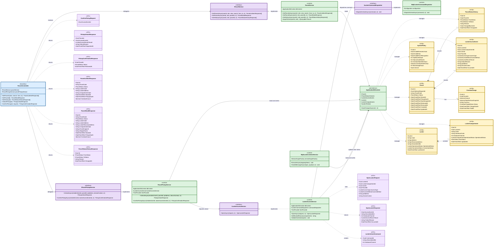

# 3.1.1 Class Diagram

```mermaid
classDiagram
direction LR

%% =========================================================
%% BOUNDARY
%% =========================================================

class ParcelsController {
    <<boundary>>
    -IParcelService parcelService
    -IParcelPickupService parcelPickupService
    +GetParcels(view, search, from, to) ParcelListItemResponse[]
    +GetParcel(id) ParcelDetailResponse
    +GetHistory(id) ParcelStatusHistoryResponse[]
    +UnlockPickup(id) PickupUnlockResponse
    +ConfirmPickup(id, request) PickupConfirmationResponse
}

%% =========================================================
%% APPLICATION INTERFACES
%% =========================================================

class IParcelService {
    <<interface>>
    +GetParcelsAsync(userId, role, view, search, from, to, ct) ParcelListItemResponse[]
    +GetParcelAsync(userId, role, parcelId, ct) ParcelDetailResponse
    +GetHistoryAsync(userId, role, parcelId, ct) ParcelStatusHistoryResponse[]
}

class IParcelPickupService {
    <<interface>>
    +UnlockAsync(residentUserId, parcelId, ipAddress, deviceContext, ct) PickupUnlockResponse
    +ConfirmPickupAsync(residentUserId, lockerAccessEventId, ct) PickupConfirmationResponse
}

class ILockerAccessService {
    <<interface>>
    +OpenAsync(request, ct) OpenLockerResponse
}

class ILockerCommandDispatcher {
    <<interface>>
    +DispatchUnlockAsync(command, ct) void
}

%% =========================================================
%% SERVICE IMPLEMENTATIONS
%% =========================================================

class ParcelService {
    <<control>>
    -ApplicationDbContext dbContext
    +GetParcelsAsync(userId, role, view, search, from, to, ct) ParcelListItemResponse[]
    +GetParcelAsync(userId, role, parcelId, ct) ParcelDetailResponse
    +GetHistoryAsync(userId, role, parcelId, ct) ParcelStatusHistoryResponse[]
    -ScopeToUser(userId, role) IQueryable~Parcel~
}

class ParcelPickupService {
    <<control>>
    -ApplicationDbContext dbContext
    -ILockerAccessService lockerAccessService
    -TimeProvider timeProvider
    +UnlockAsync(residentUserId, parcelId, ipAddress, deviceContext, ct) PickupUnlockResponse
    +ConfirmPickupAsync(residentUserId, lockerAccessEventId, ct) PickupConfirmationResponse
}

class LockerAccessService {
    <<control>>
    -ApplicationDbContext dbContext
    -ILockerCommandDispatcher commandDispatcher
    -TimeProvider timeProvider
    +OpenAsync(request, ct) OpenLockerResponse
    -GetBlockedReason(compartment) string
    -ValidateContext(request) void
}

class MqttLockerCommandDispatcher {
    <<control>>
    -IConfiguration configuration
    +DispatchUnlockAsync(command, ct) void
}

class MqttLockerListenerService {
    <<control>>
    -IServiceScopeFactory serviceScopeFactory
    +ExecuteAsync(stoppingToken) void
    +HandleMessageAsync(topic, payload, ct) void
}

class ApplicationDbContext {
    <<persistence>>
    +Parcels
    +ParcelStatusHistories
    +LockerAccessEvents
    +Lockers
    +LockerCompartments
    +SystemPolicies
    +SaveChangesAsync(ct) int
}

%% =========================================================
%% DTOs
%% =========================================================

class ConfirmPickupRequest {
    <<DTO>>
    +Guid AccessEventId
}

class PickupUnlockResponse {
    <<DTO>>
    +Guid ParcelId
    +Guid AccessEventId
    +LockerAccessResult Result
    +string FailureReason
    +DateTimeOffset RequestedAt
}

class PickupConfirmationResponse {
    <<DTO>>
    +Guid ParcelId
    +ParcelStatus Status
    +DateTimeOffset RetrievedAt
}

class ParcelListItemResponse {
    <<DTO>>
    +Guid Id
    +string ParcelCode
    +ParcelStatus Status
    +string LockerCode
    +string LockerAddress
    +string CompartmentCode
    +DateTimeOffset StoredAt
    +DateTimeOffset PickupDueAt
    +decimal OverdueAmount
}

class ParcelDetailResponse {
    <<DTO>>
    +Guid Id
    +string ParcelCode
    +ParcelStatus Status
    +string LockerCode
    +string LockerAddress
    +string LockerRecoveryAddress
    +string CompartmentCode
    +string ParcelImageUrl
    +string ShipperName
    +DateTimeOffset StoredAt
    +DateTimeOffset PickupDueAt
    +decimal OverdueAmount
}

class ParcelStatusHistoryResponse {
    <<DTO>>
    +Guid Id
    +ParcelStatus FromStatus
    +ParcelStatus ToStatus
    +string Reason
    +DateTimeOffset ChangedAt
}

class OpenLockerRequest {
    <<DTO>>
    +Guid LockerId
    +Guid LockerCompartmentId
    +Guid UserId
    +Guid ParcelId
    +LockerAccessType AccessType
    +LockerAccessMethod AccessMethod
    +string IpAddress
    +string DeviceContext
}

class OpenLockerResponse {
    <<DTO>>
    +Guid AccessEventId
    +string DeviceIdentifier
    +int HardwareChannel
    +LockerAccessResult Result
    +string FailureReason
    +DateTimeOffset OccurredAt
}

class LockerUnlockCommand {
    <<DTO>>
    +Guid CommandId
    +string DeviceIdentifier
    +int HardwareChannel
}

%% =========================================================
%% DOMAIN ENTITIES
%% =========================================================

class Parcel {
    <<entity>>
    +Guid Id
    +Guid DeliveryRequestId
    +string ParcelCode
    +ParcelStatus Status
    +DateTimeOffset StoredAt
    +DateTimeOffset PickupDueAt
    +DateTimeOffset MaxStorageUntil
    +DateTimeOffset RetrievedAt
    +DateTimeOffset RemovedAt
    +DateTimeOffset CreatedAt
    +DateTimeOffset UpdatedAt
}

class ParcelStatusHistory {
    <<entity>>
    +Guid Id
    +Guid ParcelId
    +ParcelStatus FromStatus
    +ParcelStatus ToStatus
    +string Reason
    +Guid ChangedByUserId
    +DateTimeOffset ChangedAt
}

class LockerAccessEvent {
    <<entity>>
    +Guid Id
    +Guid LockerId
    +Guid LockerCompartmentId
    +Guid UserId
    +Guid ParcelId
    +LockerAccessType AccessType
    +LockerAccessMethod AccessMethod
    +LockerAccessResult Result
    +string FailureReason
    +string IpAddress
    +string DeviceContext
    +DateTimeOffset OccurredAt
}

class OverdueCharge {
    <<entity>>
    +Guid Id
    +Guid ParcelId
    +decimal Amount
    +decimal RatePerHourSnapshot
    +string Currency
    +OverdueChargeStatus Status
    +DateTimeOffset ChargeStartAt
    +DateTimeOffset PaidAt
}

class Locker {
    <<entity>>
    +Guid Id
    +string Code
    +string Address
    +string RecoveryAddress
    +string DeviceIdentifier
    +LockerOperationalStatus OperationalStatus
    +LockerConnectionStatus ConnectionStatus
    +DateTimeOffset LastSeenAt
}

class LockerCompartment {
    <<entity>>
    +Guid Id
    +Guid LockerId
    +string Code
    +string HardwareCode
    +int HardwareChannel
    +LockerCompartmentOperationalStatus OperationalStatus
    +DoorStatus DoorStatus
    +DateTimeOffset UpdatedAt
}

class SystemPolicy {
    <<entity>>
    +Guid Id
    +bool EnableRemoteUnlock
    +bool EnableOtp
    +bool EnableFaceRecognition
    +int OtpMaxAttempts
    +int OtpLockoutMinutes
    +int OverdueStartAfterHours
    +decimal OverdueFeePerHour
    +int MaxStorageHours
    +bool IsActive
}

%% =========================================================
%% RELATIONSHIPS - theo đúng luồng layer trái sang phải
%% =========================================================

ParcelsController --> IParcelService : delegates
ParcelsController --> IParcelPickupService : delegates

IParcelService <|.. ParcelService : implements
IParcelPickupService <|.. ParcelPickupService : implements
ILockerAccessService <|.. LockerAccessService : implements
ILockerCommandDispatcher <|.. MqttLockerCommandDispatcher : implements

ParcelPickupService --> ILockerAccessService : requests unlock
LockerAccessService --> ILockerCommandDispatcher : dispatches command

ParcelService --> ApplicationDbContext : reads
ParcelPickupService --> ApplicationDbContext : reads and writes
LockerAccessService --> ApplicationDbContext : reads and writes
MqttLockerListenerService --> ApplicationDbContext : updates door status

LockerAccessService ..> OpenLockerRequest : uses
LockerAccessService ..> OpenLockerResponse : returns
LockerAccessService ..> LockerUnlockCommand : creates

ParcelsController ..> ConfirmPickupRequest : receives
ParcelsController ..> PickupUnlockResponse : returns
ParcelsController ..> PickupConfirmationResponse : returns
ParcelsController ..> ParcelListItemResponse : returns
ParcelsController ..> ParcelDetailResponse : returns
ParcelsController ..> ParcelStatusHistoryResponse : returns

ApplicationDbContext ..> Parcel : manages
ApplicationDbContext ..> ParcelStatusHistory : manages
ApplicationDbContext ..> LockerAccessEvent : manages
ApplicationDbContext ..> Locker : manages
ApplicationDbContext ..> LockerCompartment : manages
ApplicationDbContext ..> SystemPolicy : manages

Parcel "1" *-- "0..*" ParcelStatusHistory : records
Parcel "1" *-- "0..*" LockerAccessEvent : records
Parcel "1" --> "0..1" OverdueCharge : has
Locker "1" *-- "1..*" LockerCompartment : contains

%% =========================================================
%% STYLES
%% =========================================================

style ParcelsController fill:#DCEEFF,stroke:#3572A5,stroke-width:2px,color:#000

style IParcelService fill:#EADCF8,stroke:#7B4FA3,stroke-width:2px,color:#000
style IParcelPickupService fill:#EADCF8,stroke:#7B4FA3,stroke-width:2px,color:#000
style ILockerAccessService fill:#EADCF8,stroke:#7B4FA3,stroke-width:2px,color:#000
style ILockerCommandDispatcher fill:#EADCF8,stroke:#7B4FA3,stroke-width:2px,color:#000

style ParcelService fill:#DDF3DF,stroke:#4B8F4B,stroke-width:2px,color:#000
style ParcelPickupService fill:#DDF3DF,stroke:#4B8F4B,stroke-width:2px,color:#000
style LockerAccessService fill:#DDF3DF,stroke:#4B8F4B,stroke-width:2px,color:#000
style MqttLockerCommandDispatcher fill:#DDF3DF,stroke:#4B8F4B,stroke-width:2px,color:#000
style MqttLockerListenerService fill:#DDF3DF,stroke:#4B8F4B,stroke-width:2px,color:#000
style ApplicationDbContext fill:#DDF3DF,stroke:#4B8F4B,stroke-width:2px,color:#000

style ConfirmPickupRequest fill:#F1E5FF,stroke:#8A5BB5,stroke-width:1px,color:#000
style PickupUnlockResponse fill:#F1E5FF,stroke:#8A5BB5,stroke-width:1px,color:#000
style PickupConfirmationResponse fill:#F1E5FF,stroke:#8A5BB5,stroke-width:1px,color:#000
style ParcelListItemResponse fill:#F1E5FF,stroke:#8A5BB5,stroke-width:1px,color:#000
style ParcelDetailResponse fill:#F1E5FF,stroke:#8A5BB5,stroke-width:1px,color:#000
style ParcelStatusHistoryResponse fill:#F1E5FF,stroke:#8A5BB5,stroke-width:1px,color:#000
style OpenLockerRequest fill:#F1E5FF,stroke:#8A5BB5,stroke-width:1px,color:#000
style OpenLockerResponse fill:#F1E5FF,stroke:#8A5BB5,stroke-width:1px,color:#000
style LockerUnlockCommand fill:#F1E5FF,stroke:#8A5BB5,stroke-width:1px,color:#000

style Parcel fill:#FFF4CC,stroke:#B28A00,stroke-width:2px,color:#000
style ParcelStatusHistory fill:#FFF4CC,stroke:#B28A00,stroke-width:2px,color:#000
style LockerAccessEvent fill:#FFF4CC,stroke:#B28A00,stroke-width:2px,color:#000
style OverdueCharge fill:#FFF4CC,stroke:#B28A00,stroke-width:2px,color:#000
style Locker fill:#FFF4CC,stroke:#B28A00,stroke-width:2px,color:#000
style LockerCompartment fill:#FFF4CC,stroke:#B28A00,stroke-width:2px,color:#000
style SystemPolicy fill:#FFF4CC,stroke:#B28A00,stroke-width:2px,color:#000
```
