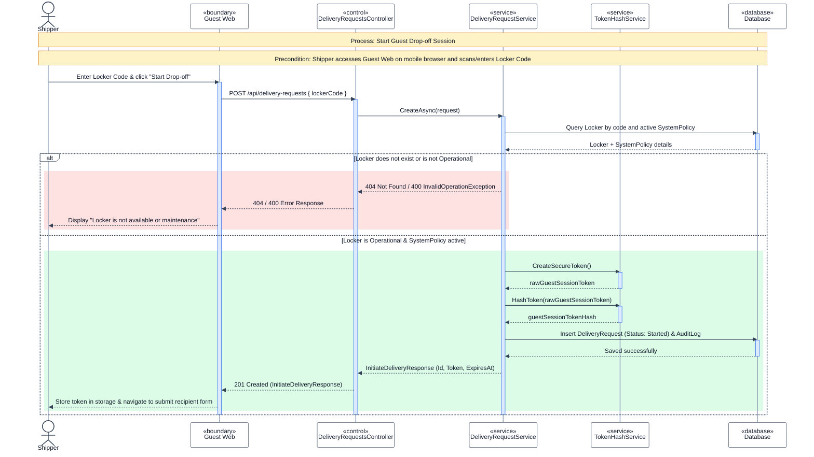

# 3.1.2 Start Guest Drop-off Session Sequence Diagram

```mermaid
%%{init: {
  "theme": "base",
  "themeVariables": {
    "actorBkg": "#FFFFFF",
    "actorBorder": "#334155",
    "actorTextColor": "#0F172A",
    "actorLineColor": "#94A3B8",
    "signalColor": "#334155",
    "signalTextColor": "#0F172A",
    "activationBkgColor": "#DBEAFE",
    "activationBorderColor": "#2563EB",
    "noteBkgColor": "#FEF3C7",
    "noteBorderColor": "#D97706",
    "noteTextColor": "#111827"
  }
}}%%

sequenceDiagram

actor SH as Shipper
participant WEB as «boundary»<br/>Guest Web
participant CTRL as «control»<br/>DeliveryRequestsController
participant SVC as «service»<br/>DeliveryRequestService
participant TOKEN as «service»<br/>TokenHashService
participant DB as «database»<br/>Database

Note over SH,DB: Process: Start Guest Drop-off Session
Note over SH,DB: Precondition: Shipper accesses Guest Web on mobile browser and scans/enters Locker Code

SH->>WEB: Enter Locker Code & click "Start Drop-off"
activate WEB

WEB->>CTRL: POST /api/delivery-requests { lockerCode }
activate CTRL

CTRL->>SVC: CreateAsync(request)
activate SVC

SVC->>DB: Query Locker by code and active SystemPolicy
activate DB
DB-->>SVC: Locker + SystemPolicy details
deactivate DB

alt Locker does not exist or is not Operational
  rect rgb(254,226,226)
    SVC-->>CTRL: 404 Not Found / 400 InvalidOperationException
    CTRL-->>WEB: 404 / 400 Error Response
    WEB-->>SH: Display "Locker is not available or maintenance"
  end
else Locker is Operational & SystemPolicy active
  rect rgb(220,252,231)
    SVC->>TOKEN: CreateSecureToken()
    activate TOKEN
    TOKEN-->>SVC: rawGuestSessionToken
    deactivate TOKEN

    SVC->>TOKEN: HashToken(rawGuestSessionToken)
    activate TOKEN
    TOKEN-->>SVC: guestSessionTokenHash
    deactivate TOKEN

    SVC->>DB: Insert DeliveryRequest (Status: Started) & AuditLog
    activate DB
    DB-->>SVC: Saved successfully
    deactivate DB

    SVC-->>CTRL: InitiateDeliveryResponse (Id, Token, ExpiresAt)
    CTRL-->>WEB: 201 Created (InitiateDeliveryResponse)
    WEB-->>SH: Store token in storage & navigate to submit recipient form
  end
end

deactivate SVC
deactivate CTRL
deactivate WEB
```
