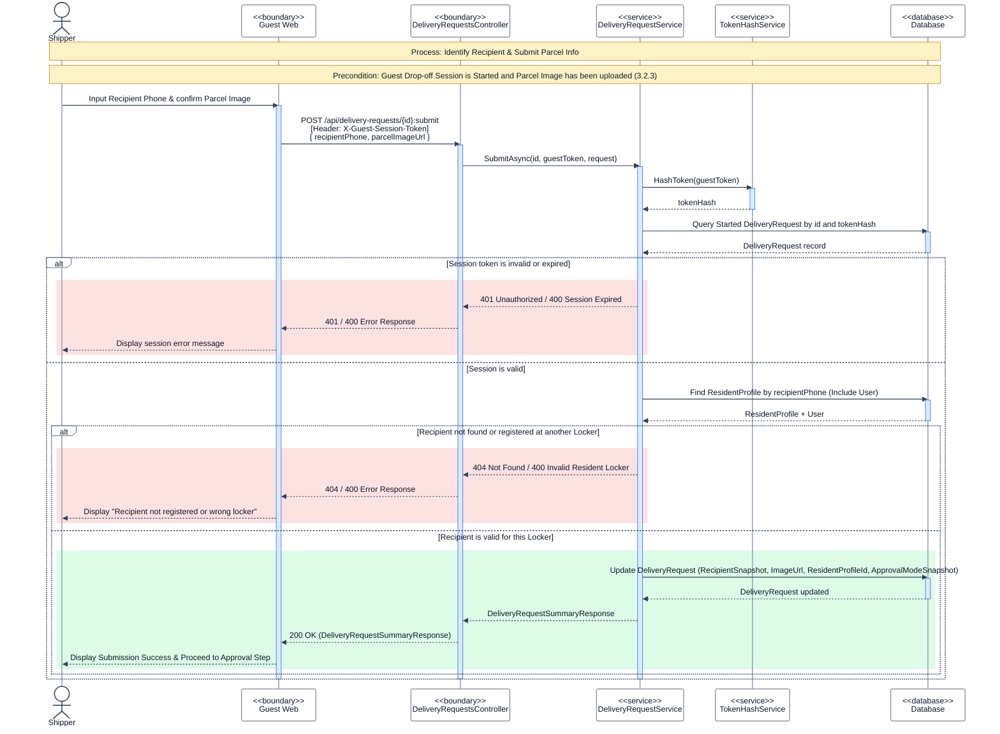

# 3.1.3 Identify Recipient and Submit Parcel Information Sequence Diagram

```mermaid
%%{init: {
  "theme": "base",
  "themeVariables": {
    "actorBkg": "#FFFFFF",
    "actorBorder": "#334155",
    "actorTextColor": "#0F172A",
    "actorLineColor": "#94A3B8",
    "signalColor": "#334155",
    "signalTextColor": "#0F172A",
    "activationBkgColor": "#DBEAFE",
    "activationBorderColor": "#2563EB",
    "noteBkgColor": "#FEF3C7",
    "noteBorderColor": "#D97706",
    "noteTextColor": "#111827"
  }
}}%%

sequenceDiagram

actor SH as Shipper
participant WEB as <<boundary>><br/>Guest Web
participant CTRL as <<boundary>><br/>DeliveryRequestsController
participant SVC as <<service>><br/>DeliveryRequestService
participant TOKEN as <<service>><br/>TokenHashService
participant DB as <<database>><br/>Database

Note over SH,DB: Process: Identify Recipient & Submit Parcel Info
Note over SH,DB: Precondition: Guest Drop-off Session is Started and Parcel Image has been uploaded (3.2.3)

SH->>WEB: Input Recipient Phone & confirm Parcel Image
activate WEB

WEB->>CTRL: POST /api/delivery-requests/{id}:submit<br/>[Header: X-Guest-Session-Token]<br/>{ recipientPhone, parcelImageUrl }
activate CTRL

CTRL->>SVC: SubmitAsync(id, guestToken, request)
activate SVC

SVC->>TOKEN: HashToken(guestToken)
activate TOKEN
TOKEN-->>SVC: tokenHash
deactivate TOKEN

SVC->>DB: Query Started DeliveryRequest by id and tokenHash
activate DB
DB-->>SVC: DeliveryRequest record
deactivate DB

alt Session token is invalid or expired
  rect rgb(254,226,226)
    SVC-->>CTRL: 401 Unauthorized / 400 Session Expired
    CTRL-->>WEB: 401 / 400 Error Response
    WEB-->>SH: Display session error message
  end
else Session is valid
  SVC->>DB: Find ResidentProfile by recipientPhone (Include User)
  activate DB
  DB-->>SVC: ResidentProfile + User
  deactivate DB

  alt Recipient not found or registered at another Locker
    rect rgb(254,226,226)
      SVC-->>CTRL: 404 Not Found / 400 Invalid Resident Locker
      CTRL-->>WEB: 404 / 400 Error Response
      WEB-->>SH: Display "Recipient not registered or wrong locker"
    end
  else Recipient is valid for this Locker
    rect rgb(220,252,231)
      SVC->>DB: Update DeliveryRequest (RecipientSnapshot, ImageUrl, ResidentProfileId, ApprovalModeSnapshot)
      activate DB
      DB-->>SVC: DeliveryRequest updated
      deactivate DB

      SVC-->>CTRL: DeliveryRequestSummaryResponse
      CTRL-->>WEB: 200 OK (DeliveryRequestSummaryResponse)
      WEB-->>SH: Display Submission Success & Proceed to Approval Step
    end
  end
end

deactivate SVC
deactivate CTRL
deactivate WEB
```
