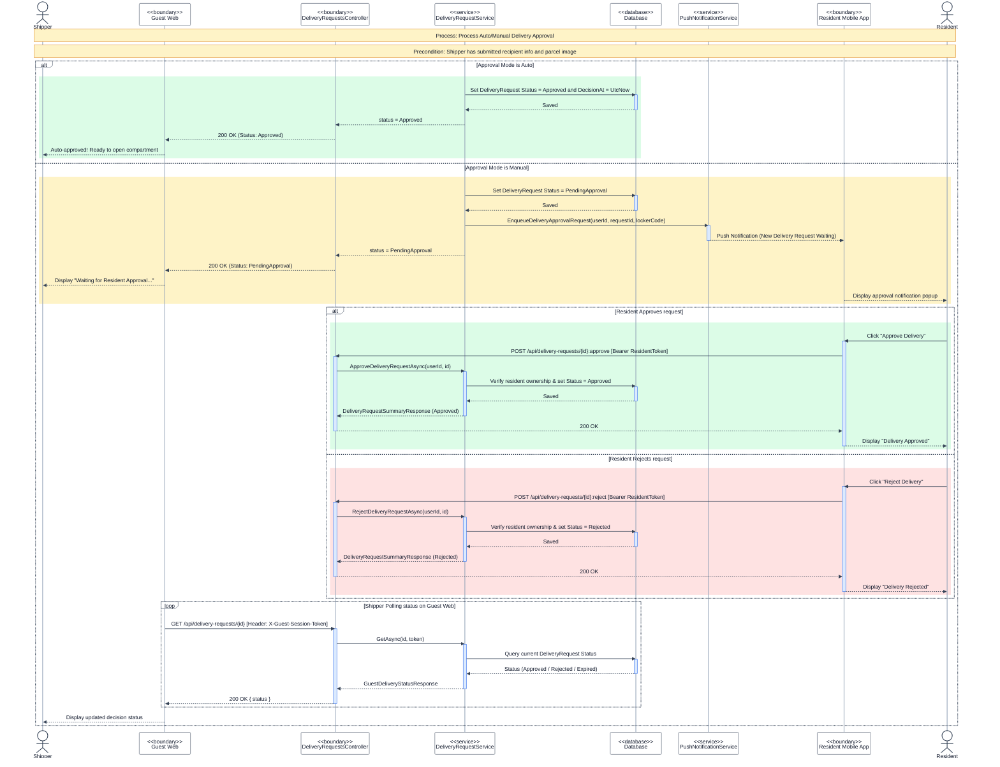

# 3.1.4 Process Auto/Manual Delivery Approval Sequence Diagram

```mermaid
%%{init: {
  "theme": "base",
  "themeVariables": {
    "actorBkg": "#FFFFFF",
    "actorBorder": "#334155",
    "actorTextColor": "#0F172A",
    "actorLineColor": "#94A3B8",
    "signalColor": "#334155",
    "signalTextColor": "#0F172A",
    "activationBkgColor": "#DBEAFE",
    "activationBorderColor": "#2563EB",
    "noteBkgColor": "#FEF3C7",
    "noteBorderColor": "#D97706",
    "noteTextColor": "#111827"
  }
}}%%

sequenceDiagram

actor SH as Shipper
participant WEB as <<boundary>><br/>Guest Web
participant CTRL as <<boundary>><br/>DeliveryRequestsController
participant SVC as <<service>><br/>DeliveryRequestService
participant DB as <<database>><br/>Database
participant PUSH as <<service>><br/>PushNotificationService
participant APP as <<boundary>><br/>Resident Mobile App
actor RES as Resident

Note over SH,RES: Process: Process Auto/Manual Delivery Approval
Note over SH,RES: Precondition: Shipper has submitted recipient info and parcel image

alt Approval Mode is Auto
  rect rgb(220,252,231)
    SVC->>DB: Set DeliveryRequest Status = Approved and DecisionAt = UtcNow
    activate DB
    DB-->>SVC: Saved
    deactivate DB

    SVC-->>CTRL: status = Approved
    CTRL-->>WEB: 200 OK (Status: Approved)
    WEB-->>SH: Auto-approved! Ready to open compartment
  end
else Approval Mode is Manual
  rect rgb(254,243,199)
    SVC->>DB: Set DeliveryRequest Status = PendingApproval
    activate DB
    DB-->>SVC: Saved
    deactivate DB

    SVC->>PUSH: EnqueueDeliveryApprovalRequest(userId, requestId, lockerCode)
    activate PUSH
    PUSH-->>APP: Push Notification (New Delivery Request Waiting)
    deactivate PUSH

    SVC-->>CTRL: status = PendingApproval
    CTRL-->>WEB: 200 OK (Status: PendingApproval)
    WEB-->>SH: Display "Waiting for Resident Approval..."

    APP-->>RES: Display approval notification popup
  end

  alt Resident Approves request
    rect rgb(220,252,231)
      RES->>APP: Click "Approve Delivery"
      activate APP
      APP->>CTRL: POST /api/delivery-requests/{id}:approve [Bearer ResidentToken]
      activate CTRL
      CTRL->>SVC: ApproveDeliveryRequestAsync(userId, id)
      activate SVC
      SVC->>DB: Verify resident ownership & set Status = Approved
      activate DB
      DB-->>SVC: Saved
      deactivate DB
      SVC-->>CTRL: DeliveryRequestSummaryResponse (Approved)
      deactivate SVC
      CTRL-->>APP: 200 OK
      deactivate CTRL
      APP-->>RES: Display "Delivery Approved"
      deactivate APP
    end
  else Resident Rejects request
    rect rgb(254,226,226)
      RES->>APP: Click "Reject Delivery"
      activate APP
      APP->>CTRL: POST /api/delivery-requests/{id}:reject [Bearer ResidentToken]
      activate CTRL
      CTRL->>SVC: RejectDeliveryRequestAsync(userId, id)
      activate SVC
      SVC->>DB: Verify resident ownership & set Status = Rejected
      activate DB
      DB-->>SVC: Saved
      deactivate DB
      SVC-->>CTRL: DeliveryRequestSummaryResponse (Rejected)
      deactivate SVC
      CTRL-->>APP: 200 OK
      deactivate CTRL
      APP-->>RES: Display "Delivery Rejected"
      deactivate APP
    end
  end

  loop Shipper Polling status on Guest Web
    WEB->>CTRL: GET /api/delivery-requests/{id} [Header: X-Guest-Session-Token]
    activate CTRL
    CTRL->>SVC: GetAsync(id, token)
    activate SVC
    SVC->>DB: Query current DeliveryRequest Status
    activate DB
    DB-->>SVC: Status (Approved / Rejected / Expired)
    deactivate DB
    SVC-->>CTRL: GuestDeliveryStatusResponse
    deactivate SVC
    CTRL-->>WEB: 200 OK { status }
    deactivate CTRL
  end
  WEB-->>SH: Display updated decision status
end
```
