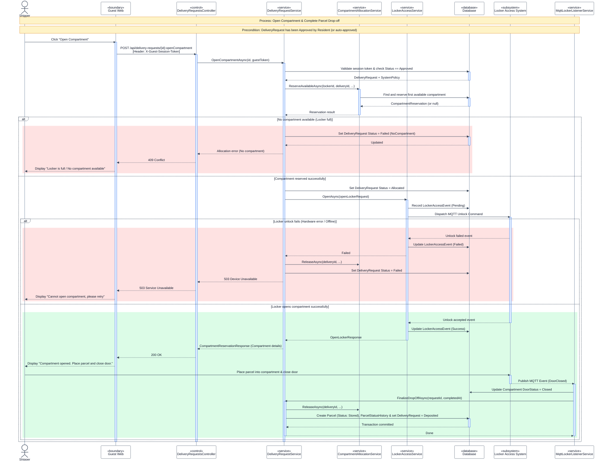

# 3.1.5 Open Compartment & Complete Parcel Drop-off Sequence Diagram

```mermaid
%%{init: {
  "theme": "base",
  "themeVariables": {
    "actorBkg": "#FFFFFF",
    "actorBorder": "#334155",
    "actorTextColor": "#0F172A",
    "actorLineColor": "#94A3B8",
    "signalColor": "#334155",
    "signalTextColor": "#0F172A",
    "activationBkgColor": "#DBEAFE",
    "activationBorderColor": "#2563EB",
    "noteBkgColor": "#FEF3C7",
    "noteBorderColor": "#D97706",
    "noteTextColor": "#111827"
  }
}}%%

sequenceDiagram

actor SH as Shipper
participant WEB as «boundary»<br/>Guest Web
participant CTRL as «control»<br/>DeliveryRequestsController
participant SVC as «service»<br/>DeliveryRequestService
participant ALLOC as «service»<br/>CompartmentAllocationService
participant ACCESS as «service»<br/>LockerAccessService
participant DB as «database»<br/>Database
participant LOCKER as «subsystem»<br/>Locker Access System
participant LISTENER as «service»<br/>MqttLockerListenerService

Note over SH,LISTENER: Process: Open Compartment & Complete Parcel Drop-off
Note over SH,LISTENER: Precondition: DeliveryRequest has been Approved by Resident (or auto-approved)

SH->>WEB: Click "Open Compartment"
activate WEB

WEB->>CTRL: POST /api/delivery-requests/{id}:openCompartment<br/>[Header: X-Guest-Session-Token]
activate CTRL

CTRL->>SVC: OpenCompartmentAsync(id, guestToken)
activate SVC

SVC->>DB: Validate session token & check Status == Approved
activate DB
DB-->>SVC: DeliveryRequest + SystemPolicy
deactivate DB

SVC->>ALLOC: ReserveAvailableAsync(lockerId, deliveryId, ...)
activate ALLOC
ALLOC->>DB: Find and reserve first available compartment
activate DB
DB-->>ALLOC: CompartmentReservation (or null)
deactivate DB
ALLOC-->>SVC: Reservation result
deactivate ALLOC

alt No compartment available (Locker full)
  rect rgb(254,226,226)
    SVC->>DB: Set DeliveryRequest Status = Failed (NoCompartment)
    activate DB
    DB-->>SVC: Updated
    deactivate DB
    SVC-->>CTRL: Allocation error (No compartment)
    CTRL-->>WEB: 409 Conflict
    WEB-->>SH: Display "Locker is full / No compartment available"
  end
else Compartment reserved successfully
  SVC->>DB: Set DeliveryRequest Status = Allocated
  SVC->>ACCESS: OpenAsync(openLockerRequest)
  activate ACCESS
  ACCESS->>DB: Record LockerAccessEvent (Pending)
  ACCESS->>LOCKER: Dispatch MQTT Unlock Command
  activate LOCKER

  alt Locker unlock fails (Hardware error / Offline)
    rect rgb(254,226,226)
      LOCKER-->>ACCESS: Unlock failed event
      ACCESS->>DB: Update LockerAccessEvent (Failed)
      ACCESS-->>SVC: Failed
      SVC->>ALLOC: ReleaseAsync(deliveryId, ...)
      SVC->>DB: Set DeliveryRequest Status = Failed
      SVC-->>CTRL: 503 Device Unavailable
      CTRL-->>WEB: 503 Service Unavailable
      WEB-->>SH: Display "Cannot open compartment, please retry"
    end
  else Locker opens compartment successfully
    rect rgb(220,252,231)
      LOCKER-->>ACCESS: Unlock accepted event
      deactivate LOCKER
      ACCESS->>DB: Update LockerAccessEvent (Success)
      ACCESS-->>SVC: OpenLockerResponse
      deactivate ACCESS
      SVC-->>CTRL: CompartmentReservationResponse (Compartment details)
      CTRL-->>WEB: 200 OK
      WEB-->>SH: Display "Compartment opened. Place parcel and close door."

      SH->>LOCKER: Place parcel into compartment & close door
      activate LOCKER
      LOCKER-->>LISTENER: Publish MQTT Event (DoorClosed)
      deactivate LOCKER
      activate LISTENER
      LISTENER->>DB: Update Compartment DoorStatus = Closed
      LISTENER->>SVC: FinalizeDropOffAsync(requestId, completedAt)
      activate SVC
      SVC->>ALLOC: ReleaseAsync(deliveryId, ...)
      SVC->>DB: Create Parcel (Status: Stored), ParcelStatusHistory & set DeliveryRequest = Deposited
      activate DB
      DB-->>SVC: Transaction committed
      deactivate DB
      SVC-->>LISTENER: Done
      deactivate SVC
      deactivate LISTENER
    end
  end
end

deactivate SVC
deactivate CTRL
deactivate WEB
```
