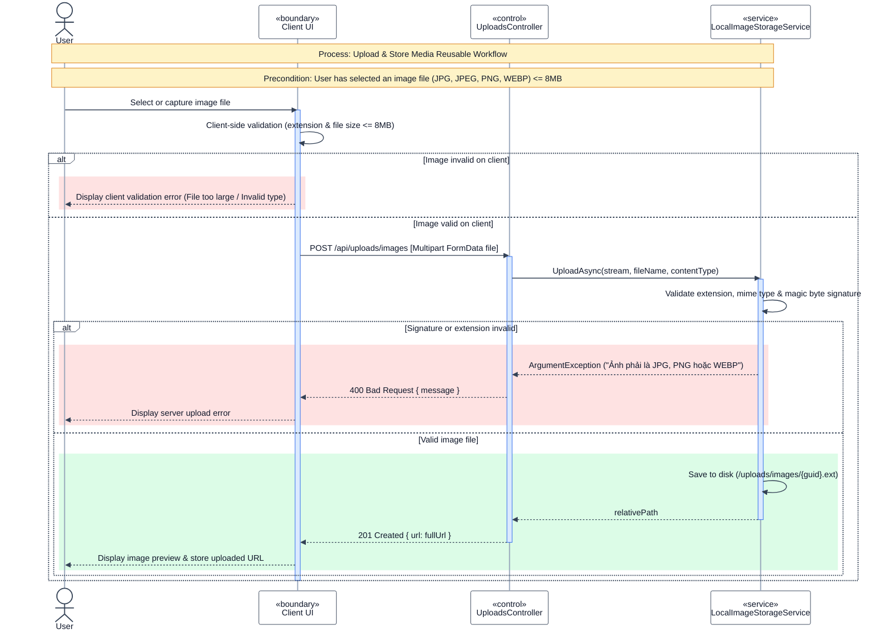

# 3.2.3 Upload & Store Media Reusable Sequence Diagram

```mermaid
%%{init: {
  "theme": "base",
  "themeVariables": {
    "actorBkg": "#FFFFFF",
    "actorBorder": "#334155",
    "actorTextColor": "#0F172A",
    "actorLineColor": "#94A3B8",
    "signalColor": "#334155",
    "signalTextColor": "#0F172A",
    "activationBkgColor": "#DBEAFE",
    "activationBorderColor": "#2563EB",
    "noteBkgColor": "#FEF3C7",
    "noteBorderColor": "#D97706",
    "noteTextColor": "#111827"
  }
}}%%

sequenceDiagram

actor USER as User
participant UI as «boundary»<br/>Client UI
participant CTRL as «control»<br/>UploadsController
participant STORAGE as «service»<br/>LocalImageStorageService

Note over USER,STORAGE: Process: Upload & Store Media Reusable Workflow
Note over USER,STORAGE: Precondition: User has selected an image file (JPG, JPEG, PNG, WEBP) <= 8MB

USER->>UI: Select or capture image file
activate UI
UI->>UI: Client-side validation (extension & file size <= 8MB)

alt Image invalid on client
  rect rgb(254,226,226)
    UI-->>USER: Display client validation error (File too large / Invalid type)
  end
else Image valid on client
  UI->>CTRL: POST /api/uploads/images [Multipart FormData file]
  activate CTRL

  CTRL->>STORAGE: UploadAsync(stream, fileName, contentType)
  activate STORAGE
  STORAGE->>STORAGE: Validate extension, mime type & magic byte signature

  alt Signature or extension invalid
    rect rgb(254,226,226)
      STORAGE-->>CTRL: ArgumentException ("Ảnh phải là JPG, PNG hoặc WEBP")
      CTRL-->>UI: 400 Bad Request { message }
      UI-->>USER: Display server upload error
    end
  else Valid image file
    rect rgb(220,252,231)
      STORAGE->>STORAGE: Save to disk (/uploads/images/{guid}.ext)
      STORAGE-->>CTRL: relativePath
      deactivate STORAGE

      CTRL-->>UI: 201 Created { url: fullUrl }
      deactivate CTRL
      UI-->>USER: Display image preview & store uploaded URL
    end
  end
end

deactivate UI
```
