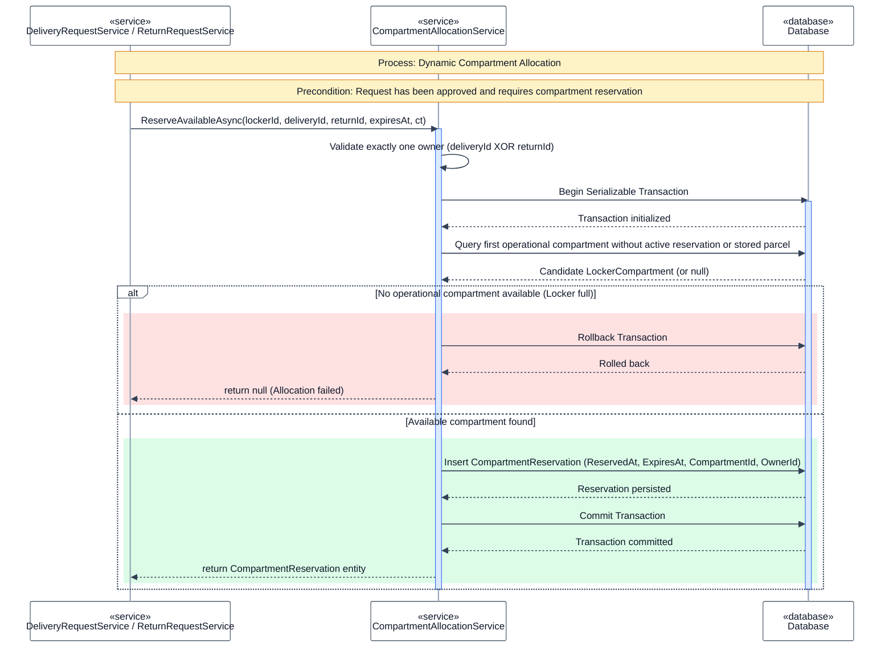

# 3.3.2 Reserve Available Compartment Sequence Diagram

```mermaid
%%{init: {
  "theme": "base",
  "themeVariables": {
    "actorBkg": "#FFFFFF",
    "actorBorder": "#334155",
    "actorTextColor": "#0F172A",
    "actorLineColor": "#94A3B8",
    "signalColor": "#334155",
    "signalTextColor": "#0F172A",
    "activationBkgColor": "#DBEAFE",
    "activationBorderColor": "#2563EB",
    "noteBkgColor": "#FEF3C7",
    "noteBorderColor": "#D97706",
    "noteTextColor": "#111827"
  }
}}%%

sequenceDiagram

participant OWNER as «service»<br/>DeliveryRequestService / ReturnRequestService
participant ALLOC as «service»<br/>CompartmentAllocationService
participant DB as «database»<br/>Database

Note over OWNER,DB: Process: Dynamic Compartment Allocation
Note over OWNER,DB: Precondition: Request has been approved and requires compartment reservation

OWNER->>ALLOC: ReserveAvailableAsync(lockerId, deliveryId, returnId, expiresAt, ct)
activate ALLOC

ALLOC->>ALLOC: Validate exactly one owner (deliveryId XOR returnId)
ALLOC->>DB: Begin Serializable Transaction
activate DB
DB-->>ALLOC: Transaction initialized

ALLOC->>DB: Query first operational compartment without active reservation or stored parcel
DB-->>ALLOC: Candidate LockerCompartment (or null)

alt No operational compartment available (Locker full)
  rect rgb(254,226,226)
    ALLOC->>DB: Rollback Transaction
    DB-->>ALLOC: Rolled back
    ALLOC-->>OWNER: return null (Allocation failed)
  end
else Available compartment found
  rect rgb(220,252,231)
    ALLOC->>DB: Insert CompartmentReservation (ReservedAt, ExpiresAt, CompartmentId, OwnerId)
    DB-->>ALLOC: Reservation persisted
    ALLOC->>DB: Commit Transaction
    DB-->>ALLOC: Transaction committed
    ALLOC-->>OWNER: return CompartmentReservation entity
  end
end

deactivate DB
deactivate ALLOC
```
