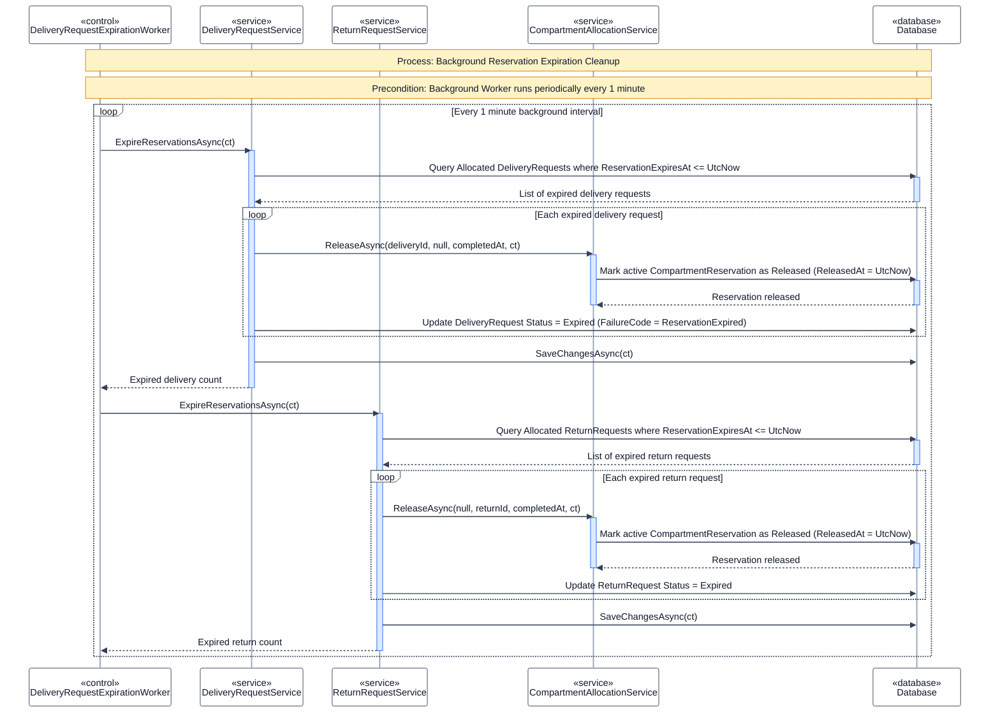

# 3.3.3 Release Expired Compartment Reservation Sequence Diagram

```mermaid
%%{init: {
  "theme": "base",
  "themeVariables": {
    "actorBkg": "#FFFFFF",
    "actorBorder": "#334155",
    "actorTextColor": "#0F172A",
    "actorLineColor": "#94A3B8",
    "signalColor": "#334155",
    "signalTextColor": "#0F172A",
    "activationBkgColor": "#DBEAFE",
    "activationBorderColor": "#2563EB",
    "noteBkgColor": "#FEF3C7",
    "noteBorderColor": "#D97706",
    "noteTextColor": "#111827"
  }
}}%%

sequenceDiagram

participant WORKER as «control»<br/>DeliveryRequestExpirationWorker
participant DELIVERY as «service»<br/>DeliveryRequestService
participant RETURNS as «service»<br/>ReturnRequestService
participant ALLOC as «service»<br/>CompartmentAllocationService
participant DB as «database»<br/>Database

Note over WORKER,DB: Process: Background Reservation Expiration Cleanup
Note over WORKER,DB: Precondition: Background Worker runs periodically every 1 minute

loop Every 1 minute background interval
  WORKER->>DELIVERY: ExpireReservationsAsync(ct)
  activate DELIVERY
  DELIVERY->>DB: Query Allocated DeliveryRequests where ReservationExpiresAt <= UtcNow
  activate DB
  DB-->>DELIVERY: List of expired delivery requests
  deactivate DB

  loop Each expired delivery request
    DELIVERY->>ALLOC: ReleaseAsync(deliveryId, null, completedAt, ct)
    activate ALLOC
    ALLOC->>DB: Mark active CompartmentReservation as Released (ReleasedAt = UtcNow)
    activate DB
    DB-->>ALLOC: Reservation released
    deactivate DB
    deactivate ALLOC
    DELIVERY->>DB: Update DeliveryRequest Status = Expired (FailureCode = ReservationExpired)
  end
  DELIVERY->>DB: SaveChangesAsync(ct)
  DELIVERY-->>WORKER: Expired delivery count
  deactivate DELIVERY

  WORKER->>RETURNS: ExpireReservationsAsync(ct)
  activate RETURNS
  RETURNS->>DB: Query Allocated ReturnRequests where ReservationExpiresAt <= UtcNow
  activate DB
  DB-->>RETURNS: List of expired return requests
  deactivate DB

  loop Each expired return request
    RETURNS->>ALLOC: ReleaseAsync(null, returnId, completedAt, ct)
    activate ALLOC
    ALLOC->>DB: Mark active CompartmentReservation as Released (ReleasedAt = UtcNow)
    activate DB
    DB-->>ALLOC: Reservation released
    deactivate DB
    deactivate ALLOC
    RETURNS->>DB: Update ReturnRequest Status = Expired
  end
  RETURNS->>DB: SaveChangesAsync(ct)
  RETURNS-->>WORKER: Expired return count
  deactivate RETURNS
end
```
