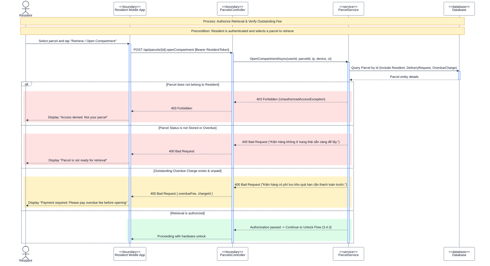

# 3.4.2 Authorize Retrieval & Verify Outstanding Fee Sequence Diagram

```mermaid
%%{init: {
  "theme": "base",
  "themeVariables": {
    "actorBkg": "#FFFFFF",
    "actorBorder": "#334155",
    "actorTextColor": "#0F172A",
    "actorLineColor": "#94A3B8",
    "signalColor": "#334155",
    "signalTextColor": "#0F172A",
    "activationBkgColor": "#DBEAFE",
    "activationBorderColor": "#2563EB",
    "noteBkgColor": "#FEF3C7",
    "noteBorderColor": "#D97706",
    "noteTextColor": "#111827"
  }
}}%%

sequenceDiagram

actor RES as Resident
participant APP as <<boundary>><br/>Resident Mobile App
participant CTRL as <<boundary>><br/>ParcelsController
participant SVC as <<service>><br/>ParcelService
participant DB as <<database>><br/>Database

Note over RES,DB: Process: Authorize Retrieval & Verify Outstanding Fee
Note over RES,DB: Precondition: Resident is authenticated and selects a parcel to retrieve

RES->>APP: Select parcel and tap "Retrieve / Open Compartment"
activate APP

APP->>CTRL: POST /api/parcels/{id}:openCompartment [Bearer ResidentToken]
activate CTRL

CTRL->>SVC: OpenCompartmentAsync(userId, parcelId, ip, device, ct)
activate SVC

SVC->>DB: Query Parcel by id (Include Resident, DeliveryRequest, OverdueCharge)
activate DB
DB-->>SVC: Parcel entity details
deactivate DB

alt Parcel does not belong to Resident
  rect rgb(254,226,226)
    SVC-->>CTRL: 403 Forbidden (UnauthorizedAccessException)
    CTRL-->>APP: 403 Forbidden
    APP-->>RES: Display "Access denied: Not your parcel"
  end
else Parcel Status is not Stored or Overdue
  rect rgb(254,226,226)
    SVC-->>CTRL: 400 Bad Request ("Kiện hàng không ở trạng thái sẵn sàng để lấy.")
    CTRL-->>APP: 400 Bad Request
    APP-->>RES: Display "Parcel is not ready for retrieval"
  end
else Outstanding Overdue Charge exists & unpaid
  rect rgb(254,243,199)
    SVC-->>CTRL: 400 Bad Request ("Kiện hàng có phí lưu kho quá hạn cần thanh toán trước.")
    CTRL-->>APP: 400 Bad Request { overdueFee, chargeId }
    APP-->>RES: Display "Payment required: Please pay overdue fee before opening"
  end
else Retrieval is authorized
  rect rgb(220,252,231)
    SVC-->>CTRL: Authorization passed -> Continue to Unlock Flow (3.4.3)
    CTRL-->>APP: Proceeding with hardware unlock
  end
end

deactivate SVC
deactivate CTRL
deactivate APP
```
