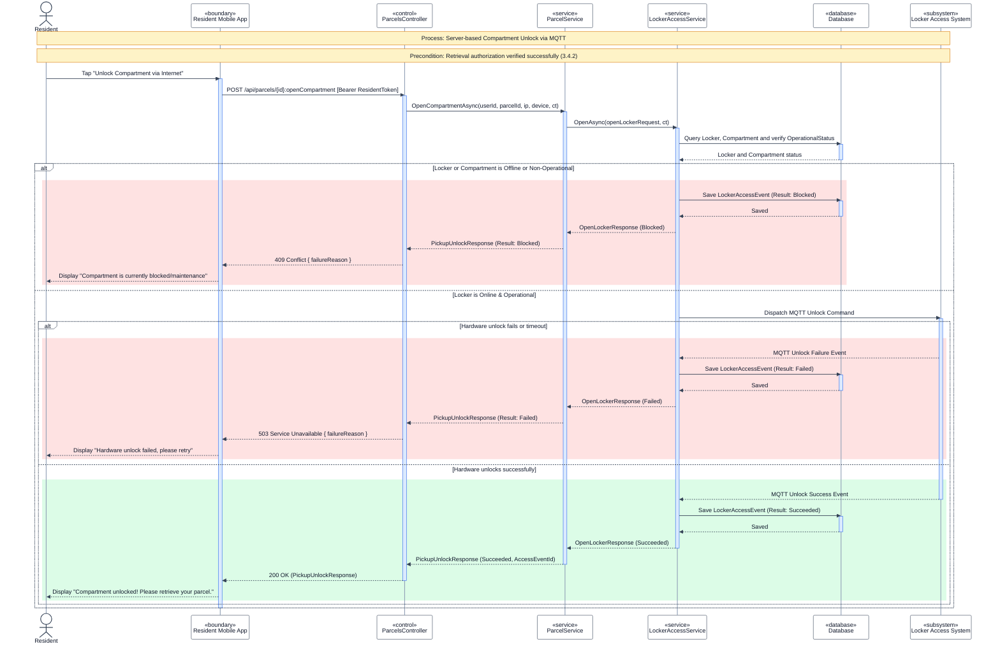

# 3.4.3 Server-based Compartment Unlock Sequence Diagram

```mermaid
%%{init: {
  "theme": "base",
  "themeVariables": {
    "actorBkg": "#FFFFFF",
    "actorBorder": "#334155",
    "actorTextColor": "#0F172A",
    "actorLineColor": "#94A3B8",
    "signalColor": "#334155",
    "signalTextColor": "#0F172A",
    "activationBkgColor": "#DBEAFE",
    "activationBorderColor": "#2563EB",
    "noteBkgColor": "#FEF3C7",
    "noteBorderColor": "#D97706",
    "noteTextColor": "#111827"
  }
}}%%

sequenceDiagram

actor RES as Resident
participant APP as «boundary»<br/>Resident Mobile App
participant CTRL as «control»<br/>ParcelsController
participant PARCEL as «service»<br/>ParcelService
participant ACCESS as «service»<br/>LockerAccessService
participant DB as «database»<br/>Database
participant LOCKER as «subsystem»<br/>Locker Access System

Note over RES,LOCKER: Process: Server-based Compartment Unlock via MQTT
Note over RES,LOCKER: Precondition: Retrieval authorization verified successfully (3.4.2)

RES->>APP: Tap "Unlock Compartment via Internet"
activate APP

APP->>CTRL: POST /api/parcels/{id}:openCompartment [Bearer ResidentToken]
activate CTRL

CTRL->>PARCEL: OpenCompartmentAsync(userId, parcelId, ip, device, ct)
activate PARCEL

PARCEL->>ACCESS: OpenAsync(openLockerRequest, ct)
activate ACCESS

ACCESS->>DB: Query Locker, Compartment and verify OperationalStatus
activate DB
DB-->>ACCESS: Locker and Compartment status
deactivate DB

alt Locker or Compartment is Offline or Non-Operational
  rect rgb(254,226,226)
    ACCESS->>DB: Save LockerAccessEvent (Result: Blocked)
    activate DB
    DB-->>ACCESS: Saved
    deactivate DB
    ACCESS-->>PARCEL: OpenLockerResponse (Blocked)
    PARCEL-->>CTRL: PickupUnlockResponse (Result: Blocked)
    CTRL-->>APP: 409 Conflict { failureReason }
    APP-->>RES: Display "Compartment is currently blocked/maintenance"
  end
else Locker is Online & Operational
  ACCESS->>LOCKER: Dispatch MQTT Unlock Command
  activate LOCKER

  alt Hardware unlock fails or timeout
    rect rgb(254,226,226)
      LOCKER-->>ACCESS: MQTT Unlock Failure Event
      ACCESS->>DB: Save LockerAccessEvent (Result: Failed)
      activate DB
      DB-->>ACCESS: Saved
      deactivate DB
      ACCESS-->>PARCEL: OpenLockerResponse (Failed)
      PARCEL-->>CTRL: PickupUnlockResponse (Result: Failed)
      CTRL-->>APP: 503 Service Unavailable { failureReason }
      APP-->>RES: Display "Hardware unlock failed, please retry"
    end
  else Hardware unlocks successfully
    rect rgb(220,252,231)
      LOCKER-->>ACCESS: MQTT Unlock Success Event
      deactivate LOCKER
      ACCESS->>DB: Save LockerAccessEvent (Result: Succeeded)
      activate DB
      DB-->>ACCESS: Saved
      deactivate DB
      ACCESS-->>PARCEL: OpenLockerResponse (Succeeded)
      deactivate ACCESS
      PARCEL-->>CTRL: PickupUnlockResponse (Succeeded, AccessEventId)
      deactivate PARCEL
      CTRL-->>APP: 200 OK (PickupUnlockResponse)
      deactivate CTRL
      APP-->>RES: Display "Compartment unlocked! Please retrieve your parcel."
    end
  end
end

deactivate APP
```
