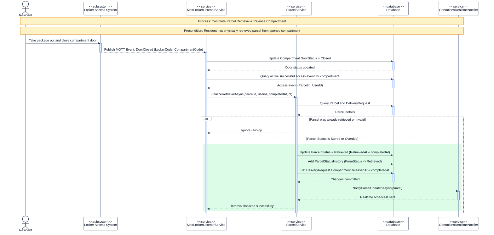

# 3.4.5 Complete Parcel Retrieval & Release Compartment Sequence Diagram

```mermaid
%%{init: {
  "theme": "base",
  "themeVariables": {
    "actorBkg": "#FFFFFF",
    "actorBorder": "#334155",
    "actorTextColor": "#0F172A",
    "actorLineColor": "#94A3B8",
    "signalColor": "#334155",
    "signalTextColor": "#0F172A",
    "activationBkgColor": "#DBEAFE",
    "activationBorderColor": "#2563EB",
    "noteBkgColor": "#FEF3C7",
    "noteBorderColor": "#D97706",
    "noteTextColor": "#111827"
  }
}}%%

sequenceDiagram

actor RES as Resident
participant LOCKER as <<subsystem>><br/>Locker Access System
participant LISTENER as <<service>><br/>MqttLockerListenerService
participant PARCEL as <<service>><br/>ParcelService
participant DB as <<database>><br/>Database
participant HUB as <<service>><br/>OperationsRealtimeNotifier

Note over RES,HUB: Process: Complete Parcel Retrieval & Release Compartment
Note over RES,HUB: Precondition: Resident has physically retrieved parcel from opened compartment

RES->>LOCKER: Take package out and close compartment door
activate LOCKER

LOCKER-->>LISTENER: Publish MQTT Event: DoorClosed (LockerCode, CompartmentCode)
deactivate LOCKER
activate LISTENER

LISTENER->>DB: Update Compartment DoorStatus = Closed
activate DB
DB-->>LISTENER: Door status updated
deactivate DB

LISTENER->>DB: Query active successful access event for compartment
activate DB
DB-->>LISTENER: Access event (ParcelId, UserId)
deactivate DB

LISTENER->>PARCEL: FinalizeRetrievalAsync(parcelId, userId, completedAt, ct)
activate PARCEL

PARCEL->>DB: Query Parcel and DeliveryRequest
activate DB
DB-->>PARCEL: Parcel details
deactivate DB

alt Parcel was already retrieved or invalid
  PARCEL-->>LISTENER: Ignore / No-op
else Parcel Status is Stored or Overdue
  rect rgb(220,252,231)
    PARCEL->>DB: Update Parcel Status = Retrieved (RetrievedAt = completedAt)
    PARCEL->>DB: Add ParcelStatusHistory (FromStatus -> Retrieved)
    PARCEL->>DB: Set DeliveryRequest CompartmentReleasedAt = completedAt
    activate DB
    DB-->>PARCEL: Changes committed
    deactivate DB

    PARCEL->>HUB: NotifyParcelUpdatedAsync(parcel)
    activate HUB
    HUB-->>PARCEL: Realtime broadcast sent
    deactivate HUB

    PARCEL-->>LISTENER: Retrieval finalized successfully
  end
end

deactivate PARCEL
deactivate LISTENER
```
