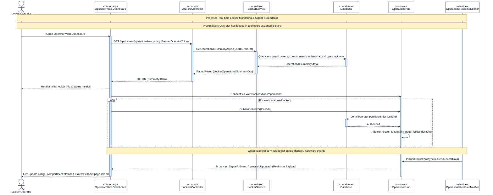

# 3.5.2 Real-time Locker Monitoring Sequence Diagram

```mermaid
%%{init: {
  "theme": "base",
  "themeVariables": {
    "actorBkg": "#FFFFFF",
    "actorBorder": "#334155",
    "actorTextColor": "#0F172A",
    "actorLineColor": "#94A3B8",
    "signalColor": "#334155",
    "signalTextColor": "#0F172A",
    "activationBkgColor": "#DBEAFE",
    "activationBorderColor": "#2563EB",
    "noteBkgColor": "#FEF3C7",
    "noteBorderColor": "#D97706",
    "noteTextColor": "#111827"
  }
}}%%

sequenceDiagram

actor OP as Locker Operator
participant WEB as «boundary»<br/>Operator Web Dashboard
participant CTRL as «control»<br/>LockersController
participant SVC as «service»<br/>LockerService
participant DB as «database»<br/>Database
participant HUB as «control»<br/>OperationsHub
participant NOTIFIER as «service»<br/>OperationsRealtimeNotifier

Note over OP,NOTIFIER: Process: Real-time Locker Monitoring & SignalR Broadcast
Note over OP,NOTIFIER: Precondition: Operator has logged in and holds assigned lockers

OP->>WEB: Open Operator Web Dashboard
activate WEB

WEB->>CTRL: GET /api/lockers/operational-summary [Bearer OperatorToken]
activate CTRL

CTRL->>SVC: GetOperationalSummaryAsync(userId, role, ct)
activate SVC

SVC->>DB: Query assigned Lockers, compartments, online status & open incidents
activate DB
DB-->>SVC: Operational summary data
deactivate DB

SVC-->>CTRL: PagedResult (LockerOperationalSummaryDto)
deactivate SVC
CTRL-->>WEB: 200 OK (Summary Data)
deactivate CTRL
WEB-->>OP: Render initial locker grid & status metrics

WEB->>HUB: Connect via WebSocket: /hubs/operations
activate HUB

loop For each assigned locker
  WEB->>HUB: SubscribeLocker(lockerId)
  HUB->>DB: Verify operator permission for lockerId
  activate DB
  DB-->>HUB: Authorized
  deactivate DB
  HUB->>HUB: Add connection to SignalR group: locker-{lockerId}
end

Note over NOTIFIER,WEB: When backend services detect status change / hardware events
NOTIFIER->>HUB: PublishToLockerAsync(lockerId, eventData)
HUB-->>WEB: Broadcast SignalR Event: "operationUpdated" (Real-time Payload)
WEB-->>OP: Live update badge, compartment statuses & alerts without page reload

deactivate HUB
deactivate WEB
```
