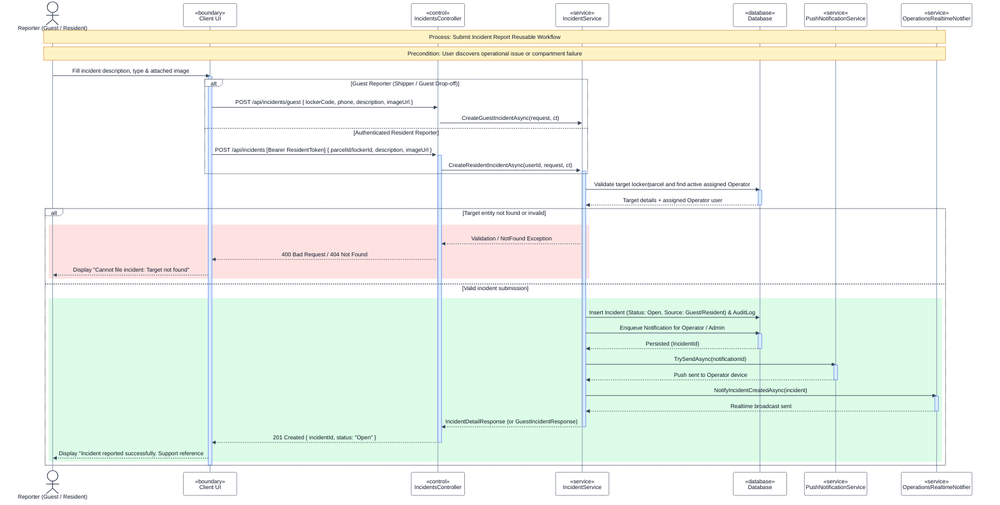

# 3.5.3 Submit Incident Report Reusable Sequence Diagram

```mermaid
%%{init: {
  "theme": "base",
  "themeVariables": {
    "actorBkg": "#FFFFFF",
    "actorBorder": "#334155",
    "actorTextColor": "#0F172A",
    "actorLineColor": "#94A3B8",
    "signalColor": "#334155",
    "signalTextColor": "#0F172A",
    "activationBkgColor": "#DBEAFE",
    "activationBorderColor": "#2563EB",
    "noteBkgColor": "#FEF3C7",
    "noteBorderColor": "#D97706",
    "noteTextColor": "#111827"
  }
}}%%

sequenceDiagram

actor REPORTER as Reporter (Guest / Resident)
participant UI as «boundary»<br/>Client UI
participant CTRL as «control»<br/>IncidentsController
participant SVC as «service»<br/>IncidentService
participant DB as «database»<br/>Database
participant PUSH as «service»<br/>PushNotificationService
participant HUB as «service»<br/>OperationsRealtimeNotifier

Note over REPORTER,HUB: Process: Submit Incident Report Reusable Workflow
Note over REPORTER,HUB: Precondition: User discovers operational issue or compartment failure

REPORTER->>UI: Fill incident description, type & attached image
activate UI

alt Guest Reporter (Shipper / Guest Drop-off)
  UI->>CTRL: POST /api/incidents/guest { lockerCode, phone, description, imageUrl }
  activate CTRL
  CTRL->>SVC: CreateGuestIncidentAsync(request, ct)
  activate SVC
else Authenticated Resident Reporter
  UI->>CTRL: POST /api/incidents [Bearer ResidentToken] { parcelId/lockerId, description, imageUrl }
  activate CTRL
  CTRL->>SVC: CreateResidentIncidentAsync(userId, request, ct)
  activate SVC
end

SVC->>DB: Validate target locker/parcel and find active assigned Operator
activate DB
DB-->>SVC: Target details + assigned Operator user
deactivate DB

alt Target entity not found or invalid
  rect rgb(254,226,226)
    SVC-->>CTRL: Validation / NotFound Exception
    CTRL-->>UI: 400 Bad Request / 404 Not Found
    UI-->>REPORTER: Display "Cannot file incident: Target not found"
  end
else Valid incident submission
  rect rgb(220,252,231)
    SVC->>DB: Insert Incident (Status: Open, Source: Guest/Resident) & AuditLog
    SVC->>DB: Enqueue Notification for Operator / Admin
    activate DB
    DB-->>SVC: Persisted (IncidentId)
    deactivate DB

    SVC->>PUSH: TrySendAsync(notificationId)
    activate PUSH
    PUSH-->>SVC: Push sent to Operator device
    deactivate PUSH

    SVC->>HUB: NotifyIncidentCreatedAsync(incident)
    activate HUB
    HUB-->>SVC: Realtime broadcast sent
    deactivate HUB

    SVC-->>CTRL: IncidentDetailResponse (or GuestIncidentResponse)
    deactivate SVC
    CTRL-->>UI: 201 Created { incidentId, status: "Open" }
    deactivate CTRL
    UI-->>REPORTER: Display "Incident reported successfully. Support reference #{id}"
  end
end

deactivate UI
```
