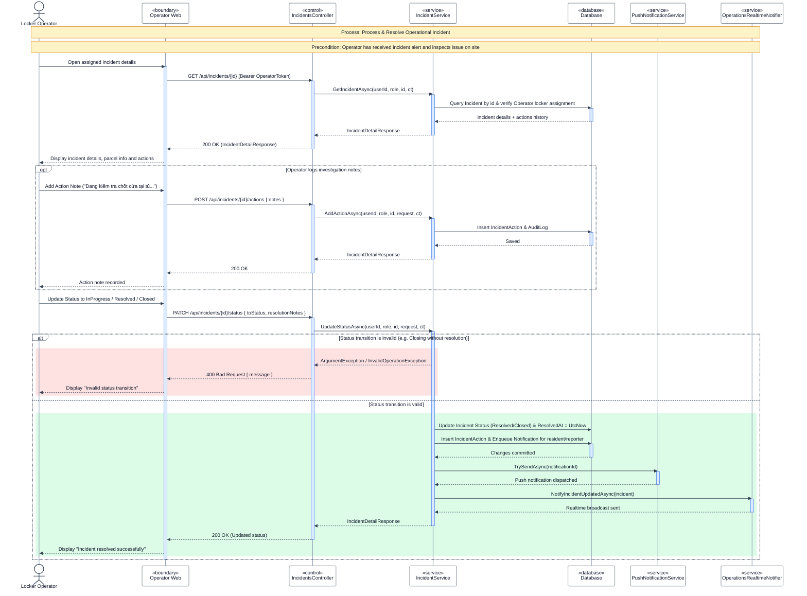

# 3.5.4 Process & Resolve Operational Incident Sequence Diagram

```mermaid
%%{init: {
  "theme": "base",
  "themeVariables": {
    "actorBkg": "#FFFFFF",
    "actorBorder": "#334155",
    "actorTextColor": "#0F172A",
    "actorLineColor": "#94A3B8",
    "signalColor": "#334155",
    "signalTextColor": "#0F172A",
    "activationBkgColor": "#DBEAFE",
    "activationBorderColor": "#2563EB",
    "noteBkgColor": "#FEF3C7",
    "noteBorderColor": "#D97706",
    "noteTextColor": "#111827"
  }
}}%%

sequenceDiagram

actor OP as Locker Operator
participant WEB as «boundary»<br/>Operator Web
participant CTRL as «control»<br/>IncidentsController
participant SVC as «service»<br/>IncidentService
participant DB as «database»<br/>Database
participant PUSH as «service»<br/>PushNotificationService
participant HUB as «service»<br/>OperationsRealtimeNotifier

Note over OP,HUB: Process: Process & Resolve Operational Incident
Note over OP,HUB: Precondition: Operator has received incident alert and inspects issue on site

OP->>WEB: Open assigned incident details
activate WEB

WEB->>CTRL: GET /api/incidents/{id} [Bearer OperatorToken]
activate CTRL

CTRL->>SVC: GetIncidentAsync(userId, role, id, ct)
activate SVC

SVC->>DB: Query Incident by id & verify Operator locker assignment
activate DB
DB-->>SVC: Incident details + actions history
deactivate DB

SVC-->>CTRL: IncidentDetailResponse
deactivate SVC
CTRL-->>WEB: 200 OK (IncidentDetailResponse)
deactivate CTRL
WEB-->>OP: Display incident details, parcel info and actions

opt Operator logs investigation notes
  OP->>WEB: Add Action Note ("Đang kiểm tra chốt cửa tại tủ...")
  WEB->>CTRL: POST /api/incidents/{id}/actions { notes }
  activate CTRL
  CTRL->>SVC: AddActionAsync(userId, role, id, request, ct)
  activate SVC
  SVC->>DB: Insert IncidentAction & AuditLog
  activate DB
  DB-->>SVC: Saved
  deactivate DB
  SVC-->>CTRL: IncidentDetailResponse
  deactivate SVC
  CTRL-->>WEB: 200 OK
  deactivate CTRL
  WEB-->>OP: Action note recorded
end

OP->>WEB: Update Status to InProgress / Resolved / Closed
WEB->>CTRL: PATCH /api/incidents/{id}/status { toStatus, resolutionNotes }
activate CTRL

CTRL->>SVC: UpdateStatusAsync(userId, role, id, request, ct)
activate SVC

alt Status transition is invalid (e.g. Closing without resolution)
  rect rgb(254,226,226)
    SVC-->>CTRL: ArgumentException / InvalidOperationException
    CTRL-->>WEB: 400 Bad Request { message }
    WEB-->>OP: Display "Invalid status transition"
  end
else Status transition is valid
  rect rgb(220,252,231)
    SVC->>DB: Update Incident Status (Resolved/Closed) & ResolvedAt = UtcNow
    SVC->>DB: Insert IncidentAction & Enqueue Notification for resident/reporter
    activate DB
    DB-->>SVC: Changes committed
    deactivate DB

    SVC->>PUSH: TrySendAsync(notificationId)
    activate PUSH
    PUSH-->>SVC: Push notification dispatched
    deactivate PUSH

    SVC->>HUB: NotifyIncidentUpdatedAsync(incident)
    activate HUB
    HUB-->>SVC: Realtime broadcast sent
    deactivate HUB

    SVC-->>CTRL: IncidentDetailResponse
    deactivate SVC
    CTRL-->>WEB: 200 OK (Updated status)
    deactivate CTRL
    WEB-->>OP: Display "Incident resolved successfully"
  end
end

deactivate WEB
```
