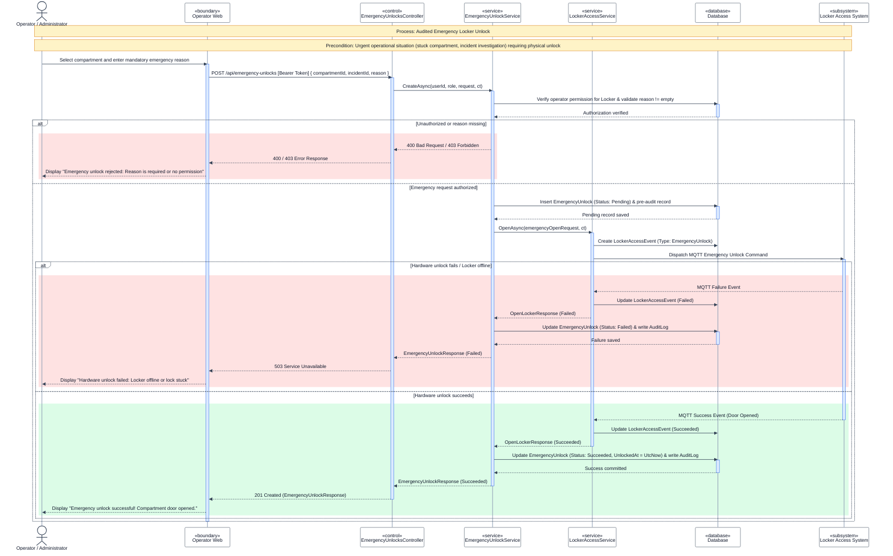

# 3.5.5 Audited Emergency Locker Unlock Sequence Diagram

```mermaid
%%{init: {
  "theme": "base",
  "themeVariables": {
    "actorBkg": "#FFFFFF",
    "actorBorder": "#334155",
    "actorTextColor": "#0F172A",
    "actorLineColor": "#94A3B8",
    "signalColor": "#334155",
    "signalTextColor": "#0F172A",
    "activationBkgColor": "#DBEAFE",
    "activationBorderColor": "#2563EB",
    "noteBkgColor": "#FEF3C7",
    "noteBorderColor": "#D97706",
    "noteTextColor": "#111827"
  }
}}%%

sequenceDiagram

actor OP as Operator / Administrator
participant WEB as «boundary»<br/>Operator Web
participant CTRL as «control»<br/>EmergencyUnlocksController
participant SVC as «service»<br/>EmergencyUnlockService
participant ACCESS as «service»<br/>LockerAccessService
participant DB as «database»<br/>Database
participant LOCKER as «subsystem»<br/>Locker Access System

Note over OP,LOCKER: Process: Audited Emergency Locker Unlock
Note over OP,LOCKER: Precondition: Urgent operational situation (stuck compartment, incident investigation) requiring physical unlock

OP->>WEB: Select compartment and enter mandatory emergency reason
activate WEB

WEB->>CTRL: POST /api/emergency-unlocks [Bearer Token] { compartmentId, incidentId, reason }
activate CTRL

CTRL->>SVC: CreateAsync(userId, role, request, ct)
activate SVC

SVC->>DB: Verify operator permission for Locker & validate reason != empty
activate DB
DB-->>SVC: Authorization verified
deactivate DB

alt Unauthorized or reason missing
  rect rgb(254,226,226)
    SVC-->>CTRL: 400 Bad Request / 403 Forbidden
    CTRL-->>WEB: 400 / 403 Error Response
    WEB-->>OP: Display "Emergency unlock rejected: Reason is required or no permission"
  end
else Emergency request authorized
  SVC->>DB: Insert EmergencyUnlock (Status: Pending) & pre-audit record
  activate DB
  DB-->>SVC: Pending record saved
  deactivate DB

  SVC->>ACCESS: OpenAsync(emergencyOpenRequest, ct)
  activate ACCESS
  ACCESS->>DB: Create LockerAccessEvent (Type: EmergencyUnlock)
  ACCESS->>LOCKER: Dispatch MQTT Emergency Unlock Command
  activate LOCKER

  alt Hardware unlock fails / Locker offline
    rect rgb(254,226,226)
      LOCKER-->>ACCESS: MQTT Failure Event
      ACCESS->>DB: Update LockerAccessEvent (Failed)
      ACCESS-->>SVC: OpenLockerResponse (Failed)
      SVC->>DB: Update EmergencyUnlock (Status: Failed) & write AuditLog
      activate DB
      DB-->>SVC: Failure saved
      deactivate DB
      SVC-->>CTRL: EmergencyUnlockResponse (Failed)
      CTRL-->>WEB: 503 Service Unavailable
      WEB-->>OP: Display "Hardware unlock failed: Locker offline or lock stuck"
    end
  else Hardware unlock succeeds
    rect rgb(220,252,231)
      LOCKER-->>ACCESS: MQTT Success Event (Door Opened)
      deactivate LOCKER
      ACCESS->>DB: Update LockerAccessEvent (Succeeded)
      ACCESS-->>SVC: OpenLockerResponse (Succeeded)
      deactivate ACCESS

      SVC->>DB: Update EmergencyUnlock (Status: Succeeded, UnlockedAt = UtcNow) & write AuditLog
      activate DB
      DB-->>SVC: Success committed
      deactivate DB

      SVC-->>CTRL: EmergencyUnlockResponse (Succeeded)
      deactivate SVC
      CTRL-->>WEB: 201 Created (EmergencyUnlockResponse)
      deactivate CTRL
      WEB-->>OP: Display "Emergency unlock successful! Compartment door opened."
    end
  end
end

deactivate WEB
```
