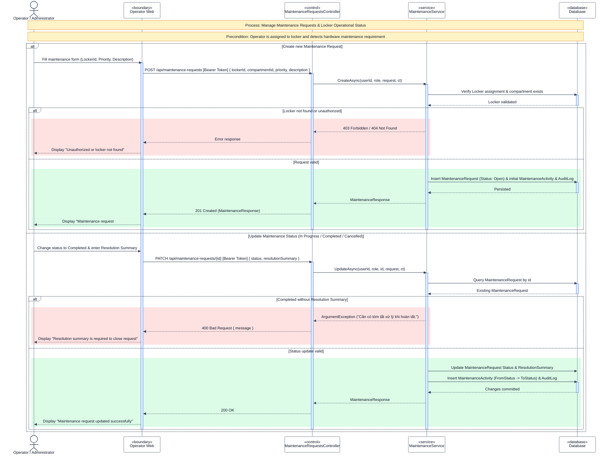

# 3.5.6 Manage Maintenance & Operational Status Sequence Diagram

```mermaid
%%{init: {
  "theme": "base",
  "themeVariables": {
    "actorBkg": "#FFFFFF",
    "actorBorder": "#334155",
    "actorTextColor": "#0F172A",
    "actorLineColor": "#94A3B8",
    "signalColor": "#334155",
    "signalTextColor": "#0F172A",
    "activationBkgColor": "#DBEAFE",
    "activationBorderColor": "#2563EB",
    "noteBkgColor": "#FEF3C7",
    "noteBorderColor": "#D97706",
    "noteTextColor": "#111827"
  }
}}%%

sequenceDiagram

actor OP as Operator / Administrator
participant WEB as «boundary»<br/>Operator Web
participant CTRL as «control»<br/>MaintenanceRequestsController
participant SVC as «service»<br/>MaintenanceService
participant DB as «database»<br/>Database

Note over OP,DB: Process: Manage Maintenance Requests & Locker Operational Status
Note over OP,DB: Precondition: Operator is assigned to locker and detects hardware maintenance requirement

alt Create new Maintenance Request
  OP->>WEB: Fill maintenance form (LockerId, Priority, Description)
  activate WEB
  WEB->>CTRL: POST /api/maintenance-requests [Bearer Token] { lockerId, compartmentId, priority, description }
  activate CTRL
  CTRL->>SVC: CreateAsync(userId, role, request, ct)
  activate SVC

  SVC->>DB: Verify Locker assignment & compartment exists
  activate DB
  DB-->>SVC: Locker validated
  deactivate DB

  alt Locker not found or unauthorized
    rect rgb(254,226,226)
      SVC-->>CTRL: 403 Forbidden / 404 Not Found
      CTRL-->>WEB: Error response
      WEB-->>OP: Display "Unauthorized or locker not found"
    end
  else Request valid
    rect rgb(220,252,231)
      SVC->>DB: Insert MaintenanceRequest (Status: Open) & initial MaintenanceActivity & AuditLog
      activate DB
      DB-->>SVC: Persisted
      deactivate DB
      SVC-->>CTRL: MaintenanceResponse
      CTRL-->>WEB: 201 Created (MaintenanceResponse)
      WEB-->>OP: Display "Maintenance request #id created"
    end
  end
  deactivate SVC
  deactivate CTRL
else Update Maintenance Status (In Progress / Completed / Cancelled)
  OP->>WEB: Change status to Completed & enter Resolution Summary
  WEB->>CTRL: PATCH /api/maintenance-requests/{id} [Bearer Token] { status, resolutionSummary }
  activate CTRL
  CTRL->>SVC: UpdateAsync(userId, role, id, request, ct)
  activate SVC

  SVC->>DB: Query MaintenanceRequest by id
  activate DB
  DB-->>SVC: Existing MaintenanceRequest
  deactivate DB

  alt Completed without Resolution Summary
    rect rgb(254,226,226)
      SVC-->>CTRL: ArgumentException ("Cần có tóm tắt xử lý khi hoàn tất.")
      CTRL-->>WEB: 400 Bad Request { message }
      WEB-->>OP: Display "Resolution summary is required to close request"
    end
  else Status update valid
    rect rgb(220,252,231)
      SVC->>DB: Update MaintenanceRequest Status & ResolutionSummary
      SVC->>DB: Insert MaintenanceActivity (FromStatus -> ToStatus) & AuditLog
      activate DB
      DB-->>SVC: Changes committed
      deactivate DB
      SVC-->>CTRL: MaintenanceResponse
      CTRL-->>WEB: 200 OK
      WEB-->>OP: Display "Maintenance request updated successfully"
    end
  end
  deactivate SVC
  deactivate CTRL
  deactivate WEB
end
```
