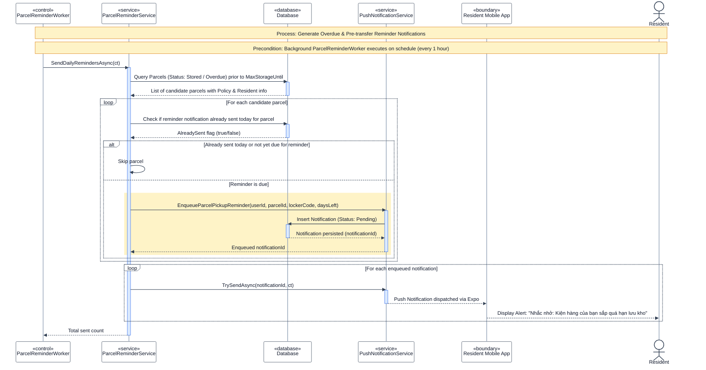

# 3.5.7 Generate Overdue & Pre-transfer Notifications Sequence Diagram

```mermaid
%%{init: {
  "theme": "base",
  "themeVariables": {
    "actorBkg": "#FFFFFF",
    "actorBorder": "#334155",
    "actorTextColor": "#0F172A",
    "actorLineColor": "#94A3B8",
    "signalColor": "#334155",
    "signalTextColor": "#0F172A",
    "activationBkgColor": "#DBEAFE",
    "activationBorderColor": "#2563EB",
    "noteBkgColor": "#FEF3C7",
    "noteBorderColor": "#D97706",
    "noteTextColor": "#111827"
  }
}}%%

sequenceDiagram

participant WORKER as «control»<br/>ParcelReminderWorker
participant SVC as «service»<br/>ParcelReminderService
participant DB as «database»<br/>Database
participant PUSH as «service»<br/>PushNotificationService
participant APP as «boundary»<br/>Resident Mobile App
actor RES as Resident

Note over WORKER,RES: Process: Generate Overdue & Pre-transfer Reminder Notifications
Note over WORKER,RES: Precondition: Background ParcelReminderWorker executes on schedule (every 1 hour)

WORKER->>SVC: SendDailyRemindersAsync(ct)
activate SVC

SVC->>DB: Query Parcels (Status: Stored / Overdue) prior to MaxStorageUntil
activate DB
DB-->>SVC: List of candidate parcels with Policy & Resident info
deactivate DB

loop For each candidate parcel
  SVC->>DB: Check if reminder notification already sent today for parcel
  activate DB
  DB-->>SVC: AlreadySent flag (true/false)
  deactivate DB

  alt Already sent today or not yet due for reminder
    SVC->>SVC: Skip parcel
  else Reminder is due
    rect rgb(254,243,199)
      SVC->>PUSH: EnqueueParcelPickupReminder(userId, parcelId, lockerCode, daysLeft)
      activate PUSH
      PUSH->>DB: Insert Notification (Status: Pending)
      activate DB
      DB-->>PUSH: Notification persisted (notificationId)
      deactivate DB
      PUSH-->>SVC: Enqueued notificationId
      deactivate PUSH
    end
  end
end

loop For each enqueued notification
  SVC->>PUSH: TrySendAsync(notificationId, ct)
  activate PUSH
  PUSH-->>APP: Push Notification dispatched via Expo
  deactivate PUSH
  APP-->>RES: Display Alert: "Nhắc nhở: Kiện hàng của bạn sắp quá hạn lưu kho"
end

SVC-->>WORKER: Total sent count
deactivate SVC
```
