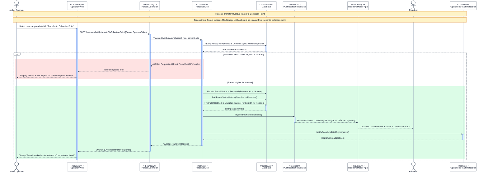

# 3.5.8 Transfer Overdue Parcel to Collection Point Sequence Diagram

```mermaid
%%{init: {
  "theme": "base",
  "themeVariables": {
    "actorBkg": "#FFFFFF",
    "actorBorder": "#334155",
    "actorTextColor": "#0F172A",
    "actorLineColor": "#94A3B8",
    "signalColor": "#334155",
    "signalTextColor": "#0F172A",
    "activationBkgColor": "#DBEAFE",
    "activationBorderColor": "#2563EB",
    "noteBkgColor": "#FEF3C7",
    "noteBorderColor": "#D97706",
    "noteTextColor": "#111827"
  }
}}%%

sequenceDiagram

actor OP as Locker Operator
participant WEB as <<boundary>><br/>Operator Web
participant CTRL as <<boundary>><br/>ParcelsController
participant SVC as <<service>><br/>ParcelService
participant DB as <<database>><br/>Database
participant PUSH as <<service>><br/>PushNotificationService
participant APP as <<boundary>><br/>Resident Mobile App
actor RES as Resident
participant HUB as <<service>><br/>OperationsRealtimeNotifier

Note over OP,HUB: Process: Transfer Overdue Parcel to Collection Point
Note over OP,HUB: Precondition: Parcel exceeds MaxStorageUntil and must be cleared from locker to collection point

OP->>WEB: Select overdue parcel & click "Transfer to Collection Point"
activate WEB

WEB->>CTRL: POST /api/parcels/{id}:transferToCollectionPoint [Bearer OperatorToken]
activate CTRL

CTRL->>SVC: TransferOverdueAsync(userId, role, parcelId, ct)
activate SVC

SVC->>DB: Query Parcel, verify status is Overdue & past MaxStorageUntil
activate DB
DB-->>SVC: Parcel and Locker details
deactivate DB

alt Parcel not found or not eligible for transfer
  rect rgb(254,226,226)
    SVC-->>CTRL: 400 Bad Request / 404 Not Found / 403 Forbidden
    CTRL-->>WEB: Transfer rejected error
    WEB-->>OP: Display "Parcel is not eligible for collection-point transfer"
  end
else Parcel eligible for transfer
  rect rgb(220,252,231)
    SVC->>DB: Update Parcel Status = Removed (RemovedAt = UtcNow)
    SVC->>DB: Add ParcelStatusHistory (Overdue -> Removed)
    SVC->>DB: Free Compartment & Enqueue transfer Notification for Resident
    activate DB
    DB-->>SVC: Changes committed
    deactivate DB

    SVC->>PUSH: TrySendAsync(notificationId)
    activate PUSH
    PUSH-->>APP: Push notification: "Kiện hàng đã chuyển về điểm lưu tập trung"
    deactivate PUSH
    APP-->>RES: Display Collection Point address & pickup instruction

    SVC->>HUB: NotifyParcelUpdatedAsync(parcel)
    activate HUB
    HUB-->>SVC: Realtime broadcast sent
    deactivate HUB

    SVC-->>CTRL: OverdueTransferResponse
    deactivate SVC
    CTRL-->>WEB: 200 OK (OverdueTransferResponse)
    deactivate CTRL
    WEB-->>OP: Display "Parcel marked as transferred. Compartment freed."
  end
end

deactivate WEB
```
