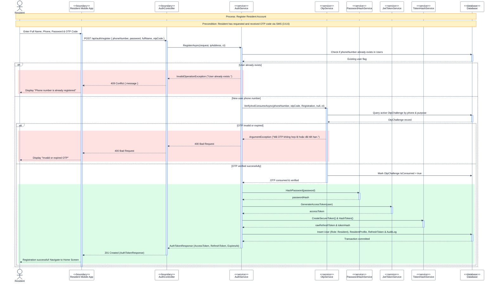

# 3.6.2 Register Resident Account Sequence Diagram

```mermaid
%%{init: {
  "theme": "base",
  "themeVariables": {
    "actorBkg": "#FFFFFF",
    "actorBorder": "#334155",
    "actorTextColor": "#0F172A",
    "actorLineColor": "#94A3B8",
    "signalColor": "#334155",
    "signalTextColor": "#0F172A",
    "activationBkgColor": "#DBEAFE",
    "activationBorderColor": "#2563EB",
    "noteBkgColor": "#FEF3C7",
    "noteBorderColor": "#D97706",
    "noteTextColor": "#111827"
  }
}}%%

sequenceDiagram

actor RES as Resident
participant APP as <<boundary>><br/>Resident Mobile App
participant CTRL as <<boundary>><br/>AuthController
participant SVC as <<service>><br/>AuthService
participant OTP as <<service>><br/>OtpService
participant PASS as <<service>><br/>PasswordHashService
participant JWT as <<service>><br/>JwtTokenService
participant TOKEN as <<service>><br/>TokenHashService
participant DB as <<database>><br/>Database

Note over RES,DB: Process: Register Resident Account
Note over RES,DB: Precondition: Resident has requested and received OTP code via SMS (3.6.6)

RES->>APP: Enter Full Name, Phone, Password & OTP Code
activate APP

APP->>CTRL: POST /api/auth/register { phoneNumber, password, fullName, otpCode }
activate CTRL

CTRL->>SVC: RegisterAsync(request, ipAddress, ct)
activate SVC

SVC->>DB: Check if phoneNumber already exists in Users
activate DB
DB-->>SVC: Existing user flag
deactivate DB

alt User already exists
  rect rgb(254,226,226)
    SVC-->>CTRL: InvalidOperationException ("User already exists.")
    CTRL-->>APP: 409 Conflict { message }
    APP-->>RES: Display "Phone number is already registered"
  end
else New user phone number
  SVC->>OTP: VerifyAndConsumeAsync(phoneNumber, otpCode, Registration, null, ct)
  activate OTP
  OTP->>DB: Query active OtpChallenge by phone & purpose
  activate DB
  DB-->>OTP: OtpChallenge record
  deactivate DB

  alt OTP invalid or expired
    rect rgb(254,226,226)
      OTP-->>SVC: ArgumentException ("Mã OTP không hợp lệ hoặc đã hết hạn.")
      SVC-->>CTRL: 400 Bad Request
      CTRL-->>APP: 400 Bad Request
      APP-->>RES: Display "Invalid or expired OTP"
    end
  else OTP verified successfully
    OTP->>DB: Mark OtpChallenge IsConsumed = true
    OTP-->>SVC: OTP consumed & verified
    deactivate OTP

    rect rgb(220,252,231)
      SVC->>PASS: HashPassword(password)
      activate PASS
      PASS-->>SVC: passwordHash
      deactivate PASS

      SVC->>JWT: GenerateAccessToken(user)
      activate JWT
      JWT-->>SVC: accessToken
      deactivate JWT

      SVC->>TOKEN: CreateSecureToken() & HashToken()
      activate TOKEN
      TOKEN-->>SVC: rawRefreshToken & tokenHash
      deactivate TOKEN

      SVC->>DB: Insert User (Role: Resident), ResidentProfile, RefreshToken & AuditLog
      activate DB
      DB-->>SVC: Transaction committed
      deactivate DB

      SVC-->>CTRL: AuthTokenResponse (AccessToken, RefreshToken, ExpiresAt)
      deactivate SVC
      CTRL-->>APP: 201 Created (AuthTokenResponse)
      deactivate CTRL
      APP-->>RES: Registration successful! Navigate to Home Screen
    end
  end
end

deactivate APP
```
