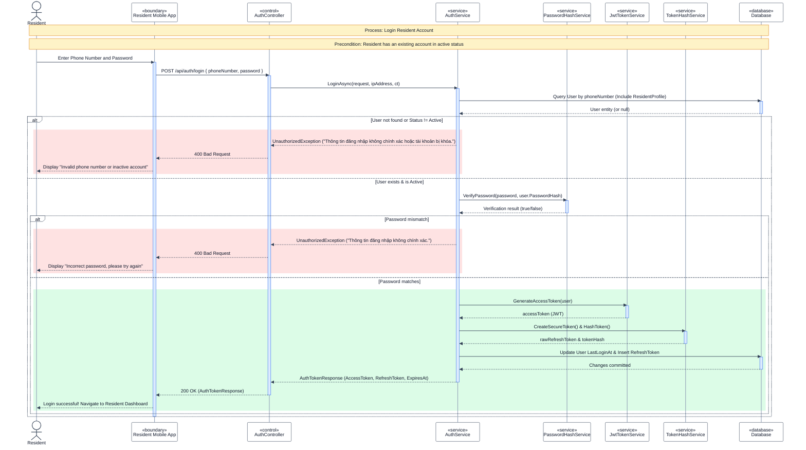

# 3.6.3 Login Resident Account Sequence Diagram

```mermaid
%%{init: {
  "theme": "base",
  "themeVariables": {
    "actorBkg": "#FFFFFF",
    "actorBorder": "#334155",
    "actorTextColor": "#0F172A",
    "actorLineColor": "#94A3B8",
    "signalColor": "#334155",
    "signalTextColor": "#0F172A",
    "activationBkgColor": "#DBEAFE",
    "activationBorderColor": "#2563EB",
    "noteBkgColor": "#FEF3C7",
    "noteBorderColor": "#D97706",
    "noteTextColor": "#111827"
  }
}}%%

sequenceDiagram

actor RES as Resident
participant APP as «boundary»<br/>Resident Mobile App
participant CTRL as «control»<br/>AuthController
participant SVC as «service»<br/>AuthService
participant PASS as «service»<br/>PasswordHashService
participant JWT as «service»<br/>JwtTokenService
participant TOKEN as «service»<br/>TokenHashService
participant DB as «database»<br/>Database

Note over RES,DB: Process: Login Resident Account
Note over RES,DB: Precondition: Resident has an existing account in active status

RES->>APP: Enter Phone Number and Password
activate APP

APP->>CTRL: POST /api/auth/login { phoneNumber, password }
activate CTRL

CTRL->>SVC: LoginAsync(request, ipAddress, ct)
activate SVC

SVC->>DB: Query User by phoneNumber (Include ResidentProfile)
activate DB
DB-->>SVC: User entity (or null)
deactivate DB

alt User not found or Status != Active
  rect rgb(254,226,226)
    SVC-->>CTRL: UnauthorizedException ("Thông tin đăng nhập không chính xác hoặc tài khoản bị khóa.")
    CTRL-->>APP: 400 Bad Request
    APP-->>RES: Display "Invalid phone number or inactive account"
  end
else User exists & is Active
  SVC->>PASS: VerifyPassword(password, user.PasswordHash)
  activate PASS
  PASS-->>SVC: Verification result (true/false)
  deactivate PASS

  alt Password mismatch
    rect rgb(254,226,226)
      SVC-->>CTRL: UnauthorizedException ("Thông tin đăng nhập không chính xác.")
      CTRL-->>APP: 400 Bad Request
      APP-->>RES: Display "Incorrect password, please try again"
    end
  else Password matches
    rect rgb(220,252,231)
      SVC->>JWT: GenerateAccessToken(user)
      activate JWT
      JWT-->>SVC: accessToken (JWT)
      deactivate JWT

      SVC->>TOKEN: CreateSecureToken() & HashToken()
      activate TOKEN
      TOKEN-->>SVC: rawRefreshToken & tokenHash
      deactivate TOKEN

      SVC->>DB: Update User LastLoginAt & Insert RefreshToken
      activate DB
      DB-->>SVC: Changes committed
      deactivate DB

      SVC-->>CTRL: AuthTokenResponse (AccessToken, RefreshToken, ExpiresAt)
      deactivate SVC
      CTRL-->>APP: 200 OK (AuthTokenResponse)
      deactivate CTRL
      APP-->>RES: Login successful! Navigate to Resident Dashboard
    end
  end
end

deactivate APP
```
