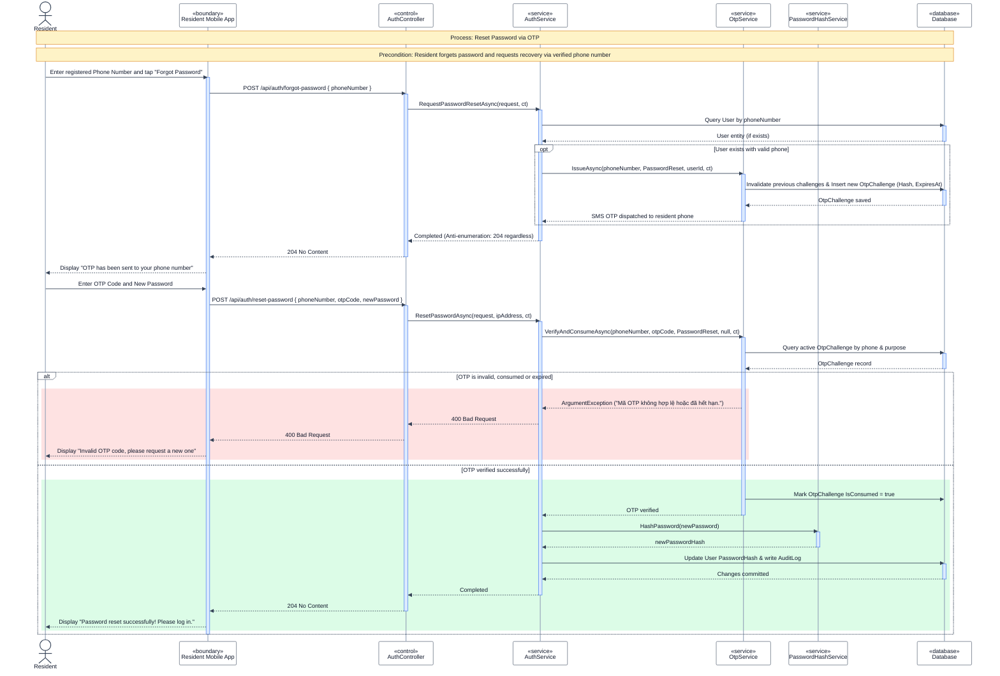

# 3.6.4 Reset Password via OTP Sequence Diagram

```mermaid
%%{init: {
  "theme": "base",
  "themeVariables": {
    "actorBkg": "#FFFFFF",
    "actorBorder": "#334155",
    "actorTextColor": "#0F172A",
    "actorLineColor": "#94A3B8",
    "signalColor": "#334155",
    "signalTextColor": "#0F172A",
    "activationBkgColor": "#DBEAFE",
    "activationBorderColor": "#2563EB",
    "noteBkgColor": "#FEF3C7",
    "noteBorderColor": "#D97706",
    "noteTextColor": "#111827"
  }
}}%%

sequenceDiagram

actor RES as Resident
participant APP as «boundary»<br/>Resident Mobile App
participant CTRL as «control»<br/>AuthController
participant SVC as «service»<br/>AuthService
participant OTP as «service»<br/>OtpService
participant PASS as «service»<br/>PasswordHashService
participant DB as «database»<br/>Database

Note over RES,DB: Process: Reset Password via OTP
Note over RES,DB: Precondition: Resident forgets password and requests recovery via verified phone number

RES->>APP: Enter registered Phone Number and tap "Forgot Password"
activate APP

APP->>CTRL: POST /api/auth/forgot-password { phoneNumber }
activate CTRL

CTRL->>SVC: RequestPasswordResetAsync(request, ct)
activate SVC

SVC->>DB: Query User by phoneNumber
activate DB
DB-->>SVC: User entity (if exists)
deactivate DB

opt User exists with valid phone
  SVC->>OTP: IssueAsync(phoneNumber, PasswordReset, userId, ct)
  activate OTP
  OTP->>DB: Invalidate previous challenges & Insert new OtpChallenge (Hash, ExpiresAt)
  activate DB
  DB-->>OTP: OtpChallenge saved
  deactivate DB
  OTP-->>SVC: SMS OTP dispatched to resident phone
  deactivate OTP
end

SVC-->>CTRL: Completed (Anti-enumeration: 204 regardless)
deactivate SVC
CTRL-->>APP: 204 No Content
deactivate CTRL
APP-->>RES: Display "OTP has been sent to your phone number"

RES->>APP: Enter OTP Code and New Password
APP->>CTRL: POST /api/auth/reset-password { phoneNumber, otpCode, newPassword }
activate CTRL

CTRL->>SVC: ResetPasswordAsync(request, ipAddress, ct)
activate SVC

SVC->>OTP: VerifyAndConsumeAsync(phoneNumber, otpCode, PasswordReset, null, ct)
activate OTP
OTP->>DB: Query active OtpChallenge by phone & purpose
activate DB
DB-->>OTP: OtpChallenge record
deactivate DB

alt OTP is invalid, consumed or expired
  rect rgb(254,226,226)
    OTP-->>SVC: ArgumentException ("Mã OTP không hợp lệ hoặc đã hết hạn.")
    SVC-->>CTRL: 400 Bad Request
    CTRL-->>APP: 400 Bad Request
    APP-->>RES: Display "Invalid OTP code, please request a new one"
  end
else OTP verified successfully
  rect rgb(220,252,231)
    OTP->>DB: Mark OtpChallenge IsConsumed = true
    OTP-->>SVC: OTP verified
    deactivate OTP

    SVC->>PASS: HashPassword(newPassword)
    activate PASS
    PASS-->>SVC: newPasswordHash
    deactivate PASS

    SVC->>DB: Update User PasswordHash & write AuditLog
    activate DB
    DB-->>SVC: Changes committed
    deactivate DB

    SVC-->>CTRL: Completed
    deactivate SVC
    CTRL-->>APP: 204 No Content
    deactivate CTRL
    APP-->>RES: Display "Password reset successfully! Please log in."
  end
end

deactivate APP
```
