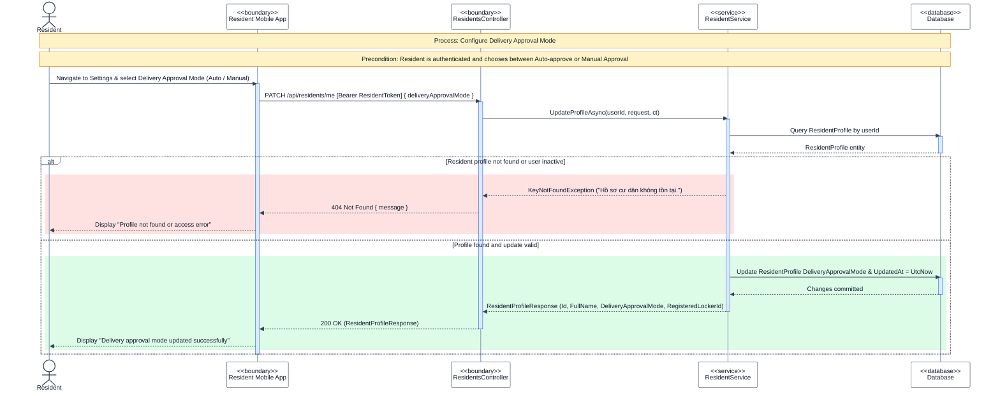

# 3.6.5 Configure Delivery Approval Mode Sequence Diagram

```mermaid
%%{init: {
  "theme": "base",
  "themeVariables": {
    "actorBkg": "#FFFFFF",
    "actorBorder": "#334155",
    "actorTextColor": "#0F172A",
    "actorLineColor": "#94A3B8",
    "signalColor": "#334155",
    "signalTextColor": "#0F172A",
    "activationBkgColor": "#DBEAFE",
    "activationBorderColor": "#2563EB",
    "noteBkgColor": "#FEF3C7",
    "noteBorderColor": "#D97706",
    "noteTextColor": "#111827"
  }
}}%%

sequenceDiagram

actor RES as Resident
participant APP as <<boundary>><br/>Resident Mobile App
participant CTRL as <<boundary>><br/>ResidentsController
participant SVC as <<service>><br/>ResidentService
participant DB as <<database>><br/>Database

Note over RES,DB: Process: Configure Delivery Approval Mode
Note over RES,DB: Precondition: Resident is authenticated and chooses between Auto-approve or Manual Approval

RES->>APP: Navigate to Settings & select Delivery Approval Mode (Auto / Manual)
activate APP

APP->>CTRL: PATCH /api/residents/me [Bearer ResidentToken] { deliveryApprovalMode }
activate CTRL

CTRL->>SVC: UpdateProfileAsync(userId, request, ct)
activate SVC

SVC->>DB: Query ResidentProfile by userId
activate DB
DB-->>SVC: ResidentProfile entity
deactivate DB

alt Resident profile not found or user inactive
  rect rgb(254,226,226)
    SVC-->>CTRL: KeyNotFoundException ("Hồ sơ cư dân không tồn tại.")
    CTRL-->>APP: 404 Not Found { message }
    APP-->>RES: Display "Profile not found or access error"
  end
else Profile found and update valid
  rect rgb(220,252,231)
    SVC->>DB: Update ResidentProfile DeliveryApprovalMode & UpdatedAt = UtcNow
    activate DB
    DB-->>SVC: Changes committed
    deactivate DB

    SVC-->>CTRL: ResidentProfileResponse (Id, FullName, DeliveryApprovalMode, RegisteredLockerId)
    deactivate SVC
    CTRL-->>APP: 200 OK (ResidentProfileResponse)
    deactivate CTRL
    APP-->>RES: Display "Delivery approval mode updated successfully"
  end
end

deactivate APP
```
