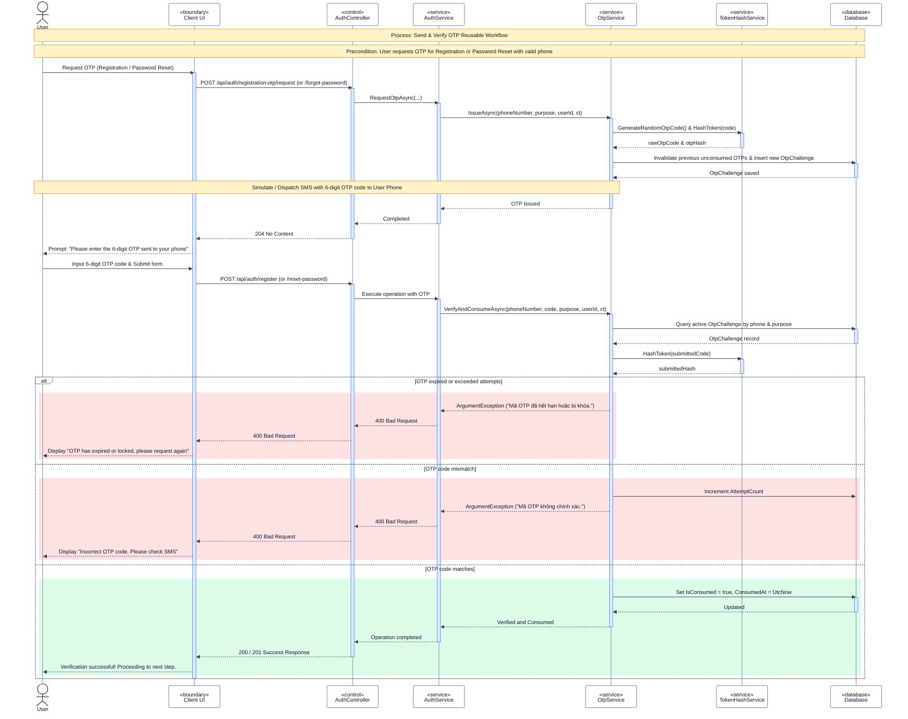

# 3.6.6 Send & Verify OTP Reusable Sequence Diagram

```mermaid
%%{init: {
  "theme": "base",
  "themeVariables": {
    "actorBkg": "#FFFFFF",
    "actorBorder": "#334155",
    "actorTextColor": "#0F172A",
    "actorLineColor": "#94A3B8",
    "signalColor": "#334155",
    "signalTextColor": "#0F172A",
    "activationBkgColor": "#DBEAFE",
    "activationBorderColor": "#2563EB",
    "noteBkgColor": "#FEF3C7",
    "noteBorderColor": "#D97706",
    "noteTextColor": "#111827"
  }
}}%%

sequenceDiagram

actor USER as User
participant UI as «boundary»<br/>Client UI
participant CTRL as «control»<br/>AuthController
participant AUTH as «service»<br/>AuthService
participant OTP as «service»<br/>OtpService
participant TOKEN as «service»<br/>TokenHashService
participant DB as «database»<br/>Database

Note over USER,DB: Process: Send & Verify OTP Reusable Workflow
Note over USER,DB: Precondition: User requests OTP for Registration or Password Reset with valid phone

USER->>UI: Request OTP (Registration / Password Reset)
activate UI
UI->>CTRL: POST /api/auth/registration-otp/request (or /forgot-password)
activate CTRL

CTRL->>AUTH: RequestOtpAsync(...)
activate AUTH
AUTH->>OTP: IssueAsync(phoneNumber, purpose, userId, ct)
activate OTP

OTP->>TOKEN: GenerateRandomOtpCode() & HashToken(code)
activate TOKEN
TOKEN-->>OTP: rawOtpCode & otpHash
deactivate TOKEN

OTP->>DB: Invalidate previous unconsumed OTPs & Insert new OtpChallenge
activate DB
DB-->>OTP: OtpChallenge saved
deactivate DB

Note over OTP,USER: Simulate / Dispatch SMS with 6-digit OTP code to User Phone
OTP-->>AUTH: OTP Issued
deactivate OTP
AUTH-->>CTRL: Completed
deactivate AUTH
CTRL-->>UI: 204 No Content
deactivate CTRL
UI-->>USER: Prompt: "Please enter the 6-digit OTP sent to your phone"

USER->>UI: Input 6-digit OTP code & Submit form
UI->>CTRL: POST /api/auth/register (or /reset-password)
activate CTRL
CTRL->>AUTH: Execute operation with OTP
activate AUTH

AUTH->>OTP: VerifyAndConsumeAsync(phoneNumber, code, purpose, userId, ct)
activate OTP

OTP->>DB: Query active OtpChallenge by phone & purpose
activate DB
DB-->>OTP: OtpChallenge record
deactivate DB

OTP->>TOKEN: HashToken(submittedCode)
activate TOKEN
TOKEN-->>OTP: submittedHash
deactivate TOKEN

alt OTP expired or exceeded attempts
  rect rgb(254,226,226)
    OTP-->>AUTH: ArgumentException ("Mã OTP đã hết hạn hoặc bị khóa.")
    AUTH-->>CTRL: 400 Bad Request
    CTRL-->>UI: 400 Bad Request
    UI-->>USER: Display "OTP has expired or locked, please request again"
  end
else OTP code mismatch
  rect rgb(254,226,226)
    OTP->>DB: Increment AttemptCount
    OTP-->>AUTH: ArgumentException ("Mã OTP không chính xác.")
    AUTH-->>CTRL: 400 Bad Request
    CTRL-->>UI: 400 Bad Request
    UI-->>USER: Display "Incorrect OTP code. Please check SMS"
  end
else OTP code matches
  rect rgb(220,252,231)
    OTP->>DB: Set IsConsumed = true, ConsumedAt = UtcNow
    activate DB
    DB-->>OTP: Updated
    deactivate DB
    OTP-->>AUTH: Verified and Consumed
    deactivate OTP

    AUTH-->>CTRL: Operation completed
    deactivate AUTH
    CTRL-->>UI: 200 / 201 Success Response
    deactivate CTRL
    UI-->>USER: Verification successful! Proceeding to next step.
  end
end

deactivate UI
```
