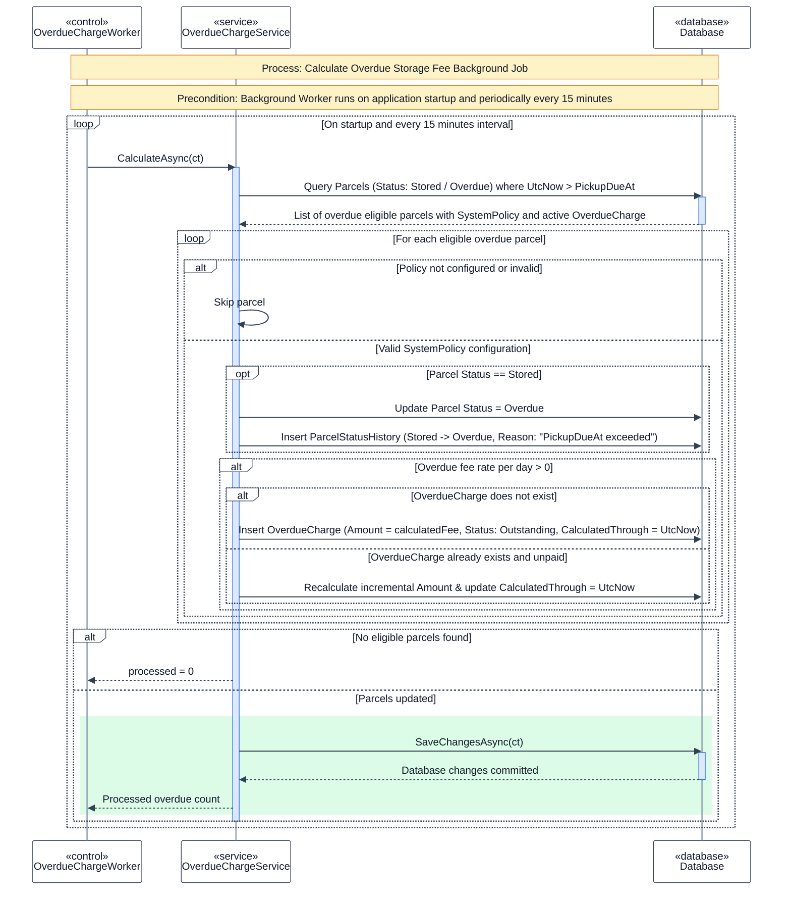

# 3.7.2 Calculate Overdue Storage Fee Sequence Diagram

```mermaid
%%{init: {
  "theme": "base",
  "themeVariables": {
    "actorBkg": "#FFFFFF",
    "actorBorder": "#334155",
    "actorTextColor": "#0F172A",
    "actorLineColor": "#94A3B8",
    "signalColor": "#334155",
    "signalTextColor": "#0F172A",
    "activationBkgColor": "#DBEAFE",
    "activationBorderColor": "#2563EB",
    "noteBkgColor": "#FEF3C7",
    "noteBorderColor": "#D97706",
    "noteTextColor": "#111827"
  }
}}%%

sequenceDiagram

participant WORKER as «control»<br/>OverdueChargeWorker
participant SVC as «service»<br/>OverdueChargeService
participant DB as «database»<br/>Database

Note over WORKER,DB: Process: Calculate Overdue Storage Fee Background Job
Note over WORKER,DB: Precondition: Background Worker runs on application startup and periodically every 15 minutes

loop On startup and every 15 minutes interval
  WORKER->>SVC: CalculateAsync(ct)
  activate SVC

  SVC->>DB: Query Parcels (Status: Stored / Overdue) where UtcNow > PickupDueAt
  activate DB
  DB-->>SVC: List of overdue eligible parcels with SystemPolicy and active OverdueCharge
  deactivate DB

  loop For each eligible overdue parcel
    alt Policy not configured or invalid
      SVC->>SVC: Skip parcel
    else Valid SystemPolicy configuration
      opt Parcel Status == Stored
        SVC->>DB: Update Parcel Status = Overdue
        SVC->>DB: Insert ParcelStatusHistory (Stored -> Overdue, Reason: "PickupDueAt exceeded")
      end

      alt Overdue fee rate per day > 0
        alt OverdueCharge does not exist
          SVC->>DB: Insert OverdueCharge (Amount = calculatedFee, Status: Outstanding, CalculatedThrough = UtcNow)
        else OverdueCharge already exists and unpaid
          SVC->>DB: Recalculate incremental Amount & update CalculatedThrough = UtcNow
        end
      end
    end
  end

  alt No eligible parcels found
    SVC-->>WORKER: processed = 0
  else Parcels updated
    rect rgb(220,252,231)
      SVC->>DB: SaveChangesAsync(ct)
      activate DB
      DB-->>SVC: Database changes committed
      deactivate DB
      SVC-->>WORKER: Processed overdue count
    end
  end
  deactivate SVC
end
```
