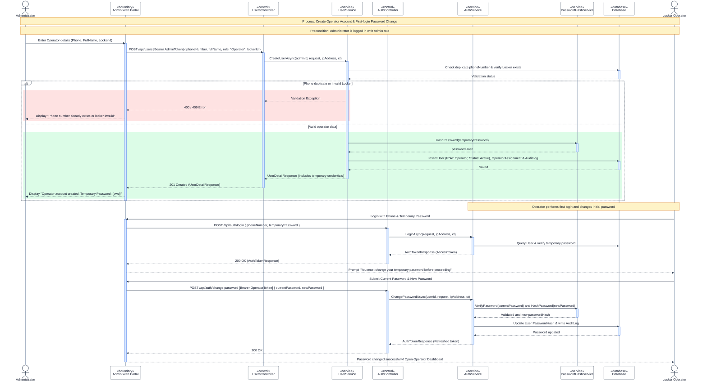

# 3.8.2 Create Operator Account & First-login Password Change Sequence Diagram

```mermaid
%%{init: {
  "theme": "base",
  "themeVariables": {
    "actorBkg": "#FFFFFF",
    "actorBorder": "#334155",
    "actorTextColor": "#0F172A",
    "actorLineColor": "#94A3B8",
    "signalColor": "#334155",
    "signalTextColor": "#0F172A",
    "activationBkgColor": "#DBEAFE",
    "activationBorderColor": "#2563EB",
    "noteBkgColor": "#FEF3C7",
    "noteBorderColor": "#D97706",
    "noteTextColor": "#111827"
  }
}}%%

sequenceDiagram

actor ADMIN as Administrator
participant WEB as «boundary»<br/>Admin Web Portal
participant USERS as «control»<br/>UsersController
participant USER_SVC as «service»<br/>UserService
participant AUTH as «control»<br/>AuthController
participant AUTH_SVC as «service»<br/>AuthService
participant PASS as «service»<br/>PasswordHashService
participant DB as «database»<br/>Database
actor OP as Locker Operator

Note over ADMIN,OP: Process: Create Operator Account & First-login Password Change
Note over ADMIN,OP: Precondition: Administrator is logged in with Admin role

ADMIN->>WEB: Enter Operator details (Phone, FullName, LockerId)
activate WEB

WEB->>USERS: POST /api/users [Bearer AdminToken] { phoneNumber, fullName, role: "Operator", lockerId }
activate USERS

USERS->>USER_SVC: CreateUserAsync(adminId, request, ipAddress, ct)
activate USER_SVC

USER_SVC->>DB: Check duplicate phoneNumber & verify Locker exists
activate DB
DB-->>USER_SVC: Validation status
deactivate DB

alt Phone duplicate or invalid Locker
  rect rgb(254,226,226)
    USER_SVC-->>USERS: Validation Exception
    USERS-->>WEB: 400 / 409 Error
    WEB-->>ADMIN: Display "Phone number already exists or locker invalid"
  end
else Valid operator data
  rect rgb(220,252,231)
    USER_SVC->>PASS: HashPassword(temporaryPassword)
    activate PASS
    PASS-->>USER_SVC: passwordHash
    deactivate PASS

    USER_SVC->>DB: Insert User (Role: Operator, Status: Active), OperatorAssignment & AuditLog
    activate DB
    DB-->>USER_SVC: Saved
    deactivate DB

    USER_SVC-->>USERS: UserDetailResponse (includes temporary credentials)
    deactivate USER_SVC
    USERS-->>WEB: 201 Created (UserDetailResponse)
    deactivate USERS
    WEB-->>ADMIN: Display "Operator account created. Temporary Password: {pwd}"
  end
end
deactivate WEB

Note over OP,AUTH_SVC: Operator performs first login and changes initial password
OP->>WEB: Login with Phone & Temporary Password
activate WEB
WEB->>AUTH: POST /api/auth/login { phoneNumber, temporaryPassword }
activate AUTH
AUTH->>AUTH_SVC: LoginAsync(request, ipAddress, ct)
activate AUTH_SVC
AUTH_SVC->>DB: Query User & verify temporary password
AUTH_SVC-->>AUTH: AuthTokenResponse (AccessToken)
deactivate AUTH_SVC
AUTH-->>WEB: 200 OK (AuthTokenResponse)
deactivate AUTH
WEB-->>OP: Prompt "You must change your temporary password before proceeding"

OP->>WEB: Submit Current Password & New Password
WEB->>AUTH: POST /api/auth/change-password [Bearer OperatorToken] { currentPassword, newPassword }
activate AUTH
AUTH->>AUTH_SVC: ChangePasswordAsync(userId, request, ipAddress, ct)
activate AUTH_SVC

AUTH_SVC->>PASS: VerifyPassword(currentPassword) and HashPassword(newPassword)
activate PASS
PASS-->>AUTH_SVC: Validated and new passwordHash
deactivate PASS

AUTH_SVC->>DB: Update User PasswordHash & write AuditLog
activate DB
DB-->>AUTH_SVC: Password updated
deactivate DB

AUTH_SVC-->>AUTH: AuthTokenResponse (Refreshed token)
deactivate AUTH_SVC
AUTH-->>WEB: 200 OK
deactivate AUTH
WEB-->>OP: Password changed successfully! Open Operator Dashboard
deactivate WEB
```
