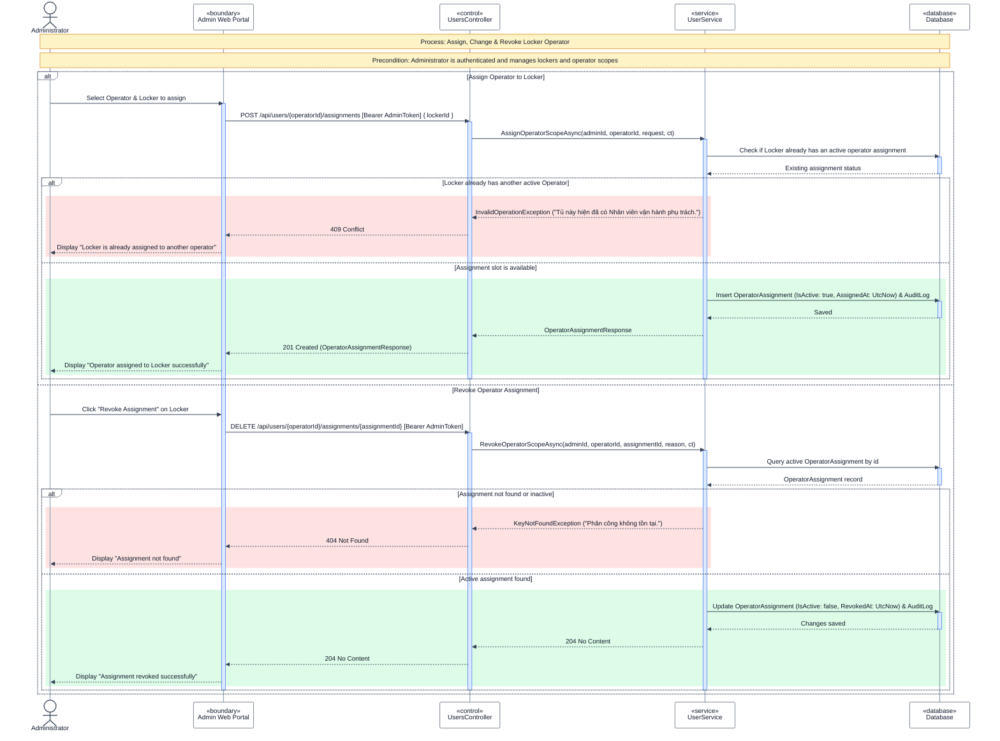

# 3.8.3 Assign, Change & Revoke Locker Operator Sequence Diagram

```mermaid
%%{init: {
  "theme": "base",
  "themeVariables": {
    "actorBkg": "#FFFFFF",
    "actorBorder": "#334155",
    "actorTextColor": "#0F172A",
    "actorLineColor": "#94A3B8",
    "signalColor": "#334155",
    "signalTextColor": "#0F172A",
    "activationBkgColor": "#DBEAFE",
    "activationBorderColor": "#2563EB",
    "noteBkgColor": "#FEF3C7",
    "noteBorderColor": "#D97706",
    "noteTextColor": "#111827"
  }
}}%%

sequenceDiagram

actor ADMIN as Administrator
participant WEB as «boundary»<br/>Admin Web Portal
participant CTRL as «control»<br/>UsersController
participant SVC as «service»<br/>UserService
participant DB as «database»<br/>Database

Note over ADMIN,DB: Process: Assign, Change & Revoke Locker Operator
Note over ADMIN,DB: Precondition: Administrator is authenticated and manages lockers and operator scopes

alt Assign Operator to Locker
  ADMIN->>WEB: Select Operator & Locker to assign
  activate WEB
  WEB->>CTRL: POST /api/users/{operatorId}/assignments [Bearer AdminToken] { lockerId }
  activate CTRL
  CTRL->>SVC: AssignOperatorScopeAsync(adminId, operatorId, request, ct)
  activate SVC

  SVC->>DB: Check if Locker already has an active operator assignment
  activate DB
  DB-->>SVC: Existing assignment status
  deactivate DB

  alt Locker already has another active Operator
    rect rgb(254,226,226)
      SVC-->>CTRL: InvalidOperationException ("Tủ này hiện đã có Nhân viên vận hành phụ trách.")
      CTRL-->>WEB: 409 Conflict
      WEB-->>ADMIN: Display "Locker is already assigned to another operator"
    end
  else Assignment slot is available
    rect rgb(220,252,231)
      SVC->>DB: Insert OperatorAssignment (IsActive: true, AssignedAt: UtcNow) & AuditLog
      activate DB
      DB-->>SVC: Saved
      deactivate DB
      SVC-->>CTRL: OperatorAssignmentResponse
      CTRL-->>WEB: 201 Created (OperatorAssignmentResponse)
      WEB-->>ADMIN: Display "Operator assigned to Locker successfully"
    end
  end
  deactivate SVC
  deactivate CTRL
else Revoke Operator Assignment
  ADMIN->>WEB: Click "Revoke Assignment" on Locker
  WEB->>CTRL: DELETE /api/users/{operatorId}/assignments/{assignmentId} [Bearer AdminToken]
  activate CTRL
  CTRL->>SVC: RevokeOperatorScopeAsync(adminId, operatorId, assignmentId, reason, ct)
  activate SVC

  SVC->>DB: Query active OperatorAssignment by id
  activate DB
  DB-->>SVC: OperatorAssignment record
  deactivate DB

  alt Assignment not found or inactive
    rect rgb(254,226,226)
      SVC-->>CTRL: KeyNotFoundException ("Phân công không tồn tại.")
      CTRL-->>WEB: 404 Not Found
      WEB-->>ADMIN: Display "Assignment not found"
    end
  else Active assignment found
    rect rgb(220,252,231)
      SVC->>DB: Update OperatorAssignment (IsActive: false, RevokedAt: UtcNow) & AuditLog
      activate DB
      DB-->>SVC: Changes saved
      deactivate DB
      SVC-->>CTRL: 204 No Content
      CTRL-->>WEB: 204 No Content
      WEB-->>ADMIN: Display "Assignment revoked successfully"
    end
  end
  deactivate SVC
  deactivate CTRL
  deactivate WEB
end
```
