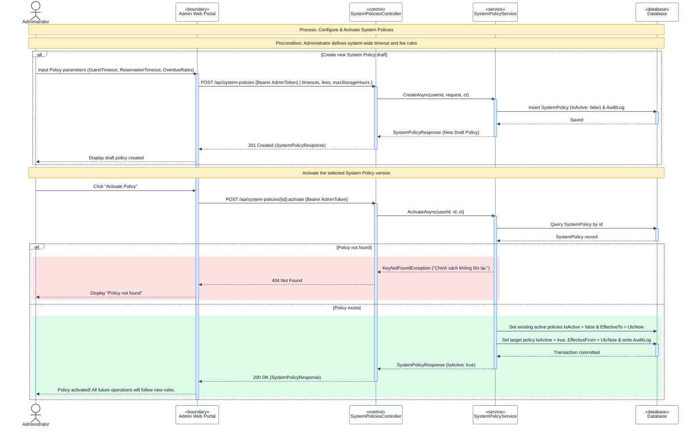

# 3.8.4 Configure & Activate System Policies Sequence Diagram

```mermaid
%%{init: {
  "theme": "base",
  "themeVariables": {
    "actorBkg": "#FFFFFF",
    "actorBorder": "#334155",
    "actorTextColor": "#0F172A",
    "actorLineColor": "#94A3B8",
    "signalColor": "#334155",
    "signalTextColor": "#0F172A",
    "activationBkgColor": "#DBEAFE",
    "activationBorderColor": "#2563EB",
    "noteBkgColor": "#FEF3C7",
    "noteBorderColor": "#D97706",
    "noteTextColor": "#111827"
  }
}}%%

sequenceDiagram

actor ADMIN as Administrator
participant WEB as «boundary»<br/>Admin Web Portal
participant CTRL as «control»<br/>SystemPoliciesController
participant SVC as «service»<br/>SystemPolicyService
participant DB as «database»<br/>Database

Note over ADMIN,DB: Process: Configure & Activate System Policies
Note over ADMIN,DB: Precondition: Administrator defines system-wide timeout and fee rules

alt Create new System Policy draft
  ADMIN->>WEB: Input Policy parameters (GuestTimeout, ReservationTimeout, OverdueRates)
  activate WEB
  WEB->>CTRL: POST /api/system-policies [Bearer AdminToken] { timeouts, fees, maxStorageHours }
  activate CTRL
  CTRL->>SVC: CreateAsync(userId, request, ct)
  activate SVC

  SVC->>DB: Insert SystemPolicy (IsActive: false) & AuditLog
  activate DB
  DB-->>SVC: Saved
  deactivate DB
  SVC-->>CTRL: SystemPolicyResponse (New Draft Policy)
  deactivate SVC
  CTRL-->>WEB: 201 Created (SystemPolicyResponse)
  deactivate CTRL
  WEB-->>ADMIN: Display draft policy created
end

Note over ADMIN,DB: Activate the selected System Policy version
ADMIN->>WEB: Click "Activate Policy"
WEB->>CTRL: POST /api/system-policies/{id}:activate [Bearer AdminToken]
activate CTRL
CTRL->>SVC: ActivateAsync(userId, id, ct)
activate SVC

SVC->>DB: Query SystemPolicy by id
activate DB
DB-->>SVC: SystemPolicy record
deactivate DB

alt Policy not found
  rect rgb(254,226,226)
    SVC-->>CTRL: KeyNotFoundException ("Chính sách không tồn tại.")
    CTRL-->>WEB: 404 Not Found
    WEB-->>ADMIN: Display "Policy not found"
  end
else Policy exists
  rect rgb(220,252,231)
    SVC->>DB: Set existing active policies IsActive = false & EffectiveTo = UtcNow
    SVC->>DB: Set target policy IsActive = true, EffectiveFrom = UtcNow & write AuditLog
    activate DB
    DB-->>SVC: Transaction committed
    deactivate DB

    SVC-->>CTRL: SystemPolicyResponse (IsActive: true)
    deactivate SVC
    CTRL-->>WEB: 200 OK (SystemPolicyResponse)
    deactivate CTRL
    WEB-->>ADMIN: Policy activated! All future operations will follow new rules.
  end
end

deactivate WEB
```
