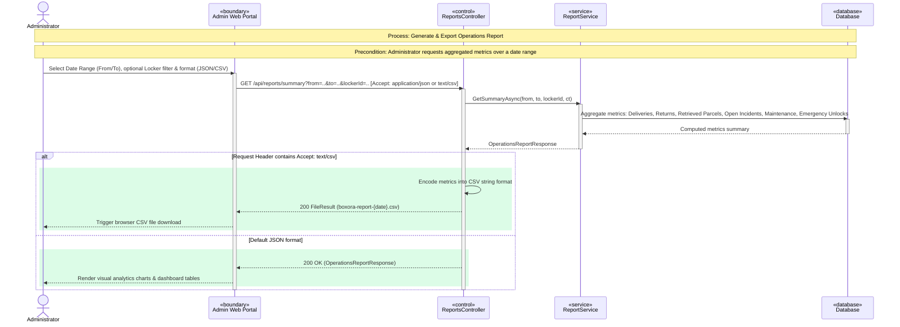

# 3.8.5 Generate & Export System Reports Sequence Diagram

```mermaid
%%{init: {
  "theme": "base",
  "themeVariables": {
    "actorBkg", "#FFFFFF",
    "actorBorder": "#334155",
    "actorTextColor": "#0F172A",
    "actorLineColor": "#94A3B8",
    "signalColor": "#334155",
    "signalTextColor": "#0F172A",
    "activationBkgColor": "#DBEAFE",
    "activationBorderColor": "#2563EB",
    "noteBkgColor": "#FEF3C7",
    "noteBorderColor": "#D97706",
    "noteTextColor": "#111827"
  }
}}%%

sequenceDiagram

actor ADMIN as Administrator
participant WEB as «boundary»<br/>Admin Web Portal
participant CTRL as «control»<br/>ReportsController
participant SVC as «service»<br/>ReportService
participant DB as «database»<br/>Database

Note over ADMIN,DB: Process: Generate & Export Operations Report
Note over ADMIN,DB: Precondition: Administrator requests aggregated metrics over a date range

ADMIN->>WEB: Select Date Range (From/To), optional Locker filter & format (JSON/CSV)
activate WEB

WEB->>CTRL: GET /api/reports/summary?from=..&to=..&lockerId=.. [Accept: application/json or text/csv]
activate CTRL

CTRL->>SVC: GetSummaryAsync(from, to, lockerId, ct)
activate SVC

SVC->>DB: Aggregate metrics: Deliveries, Returns, Retrieved Parcels, Open Incidents, Maintenance, Emergency Unlocks
activate DB
DB-->>SVC: Computed metrics summary
deactivate DB

SVC-->>CTRL: OperationsReportResponse
deactivate SVC

alt Request Header contains Accept: text/csv
  rect rgb(220,252,231)
    CTRL->>CTRL: Encode metrics into CSV string format
    CTRL-->>WEB: 200 FileResult (boxora-report-{date}.csv)
    WEB-->>ADMIN: Trigger browser CSV file download
  end
else Default JSON format
  rect rgb(220,252,231)
    CTRL-->>WEB: 200 OK (OperationsReportResponse)
    WEB-->>ADMIN: Render visual analytics charts & dashboard tables
  end
end

deactivate CTRL
deactivate WEB
```
