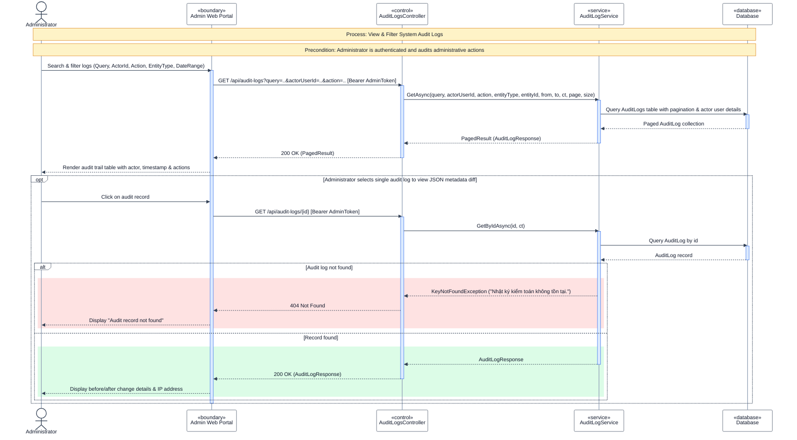

# 3.8.6 View System Audit Logs Sequence Diagram

```mermaid
%%{init: {
  "theme": "base",
  "themeVariables": {
    "actorBkg": "#FFFFFF",
    "actorBorder": "#334155",
    "actorTextColor": "#0F172A",
    "actorLineColor": "#94A3B8",
    "signalColor": "#334155",
    "signalTextColor": "#0F172A",
    "activationBkgColor": "#DBEAFE",
    "activationBorderColor": "#2563EB",
    "noteBkgColor": "#FEF3C7",
    "noteBorderColor": "#D97706",
    "noteTextColor": "#111827"
  }
}}%%

sequenceDiagram

actor ADMIN as Administrator
participant WEB as «boundary»<br/>Admin Web Portal
participant CTRL as «control»<br/>AuditLogsController
participant SVC as «service»<br/>AuditLogService
participant DB as «database»<br/>Database

Note over ADMIN,DB: Process: View & Filter System Audit Logs
Note over ADMIN,DB: Precondition: Administrator is authenticated and audits administrative actions

ADMIN->>WEB: Search & filter logs (Query, ActorId, Action, EntityType, DateRange)
activate WEB

WEB->>CTRL: GET /api/audit-logs?query=..&actorUserId=..&action=.. [Bearer AdminToken]
activate CTRL

CTRL->>SVC: GetAsync(query, actorUserId, action, entityType, entityId, from, to, ct, page, size)
activate SVC

SVC->>DB: Query AuditLogs table with pagination & actor user details
activate DB
DB-->>SVC: Paged AuditLog collection
deactivate DB

SVC-->>CTRL: PagedResult (AuditLogResponse)
deactivate SVC
CTRL-->>WEB: 200 OK (PagedResult)
deactivate CTRL
WEB-->>ADMIN: Render audit trail table with actor, timestamp & actions

opt Administrator selects single audit log to view JSON metadata diff
  ADMIN->>WEB: Click on audit record #{id}
  WEB->>CTRL: GET /api/audit-logs/{id} [Bearer AdminToken]
  activate CTRL
  CTRL->>SVC: GetByIdAsync(id, ct)
  activate SVC
  SVC->>DB: Query AuditLog by id
  activate DB
  DB-->>SVC: AuditLog record
  deactivate DB

  alt Audit log not found
    rect rgb(254,226,226)
      SVC-->>CTRL: KeyNotFoundException ("Nhật ký kiểm toán không tồn tại.")
      CTRL-->>WEB: 404 Not Found
      WEB-->>ADMIN: Display "Audit record not found"
    end
  else Record found
    rect rgb(220,252,231)
      SVC-->>CTRL: AuditLogResponse
      deactivate SVC
      CTRL-->>WEB: 200 OK (AuditLogResponse)
      deactivate CTRL
      WEB-->>ADMIN: Display before/after change details & IP address
    end
  end
end

deactivate WEB
```
