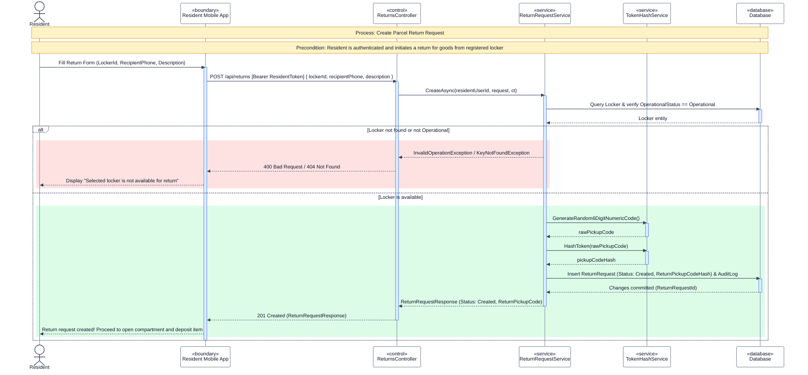

# 3.9.2 Create Return Request Sequence Diagram

```mermaid
%%{init: {
  "theme": "base",
  "themeVariables": {
    "actorBkg": "#FFFFFF",
    "actorBorder": "#334155",
    "actorTextColor": "#0F172A",
    "actorLineColor": "#94A3B8",
    "signalColor": "#334155",
    "signalTextColor": "#0F172A",
    "activationBkgColor": "#DBEAFE",
    "activationBorderColor": "#2563EB",
    "noteBkgColor": "#FEF3C7",
    "noteBorderColor": "#D97706",
    "noteTextColor": "#111827"
  }
}}%%

sequenceDiagram

actor RES as Resident
participant APP as «boundary»<br/>Resident Mobile App
participant CTRL as «control»<br/>ReturnsController
participant SVC as «service»<br/>ReturnRequestService
participant TOKEN as «service»<br/>TokenHashService
participant DB as «database»<br/>Database

Note over RES,DB: Process: Create Parcel Return Request
Note over RES,DB: Precondition: Resident is authenticated and initiates a return for goods from registered locker

RES->>APP: Fill Return Form (LockerId, RecipientPhone, Description)
activate APP

APP->>CTRL: POST /api/returns [Bearer ResidentToken] { lockerId, recipientPhone, description }
activate CTRL

CTRL->>SVC: CreateAsync(residentUserId, request, ct)
activate SVC

SVC->>DB: Query Locker & verify OperationalStatus == Operational
activate DB
DB-->>SVC: Locker entity
deactivate DB

alt Locker not found or not Operational
  rect rgb(254,226,226)
    SVC-->>CTRL: InvalidOperationException / KeyNotFoundException
    CTRL-->>APP: 400 Bad Request / 404 Not Found
    APP-->>RES: Display "Selected locker is not available for return"
  end
else Locker is available
  rect rgb(220,252,231)
    SVC->>TOKEN: GenerateRandom6DigitNumericCode()
    activate TOKEN
    TOKEN-->>SVC: rawPickupCode
    deactivate TOKEN

    SVC->>TOKEN: HashToken(rawPickupCode)
    activate TOKEN
    TOKEN-->>SVC: pickupCodeHash
    deactivate TOKEN

    SVC->>DB: Insert ReturnRequest (Status: Created, ReturnPickupCodeHash) & AuditLog
    activate DB
    DB-->>SVC: Changes committed (ReturnRequestId)
    deactivate DB

    SVC-->>CTRL: ReturnRequestResponse (Status: Created, ReturnPickupCode)
    deactivate SVC
    CTRL-->>APP: 201 Created (ReturnRequestResponse)
    deactivate CTRL
    APP-->>RES: Return request created! Proceed to open compartment and deposit item
  end
end

deactivate APP
```
