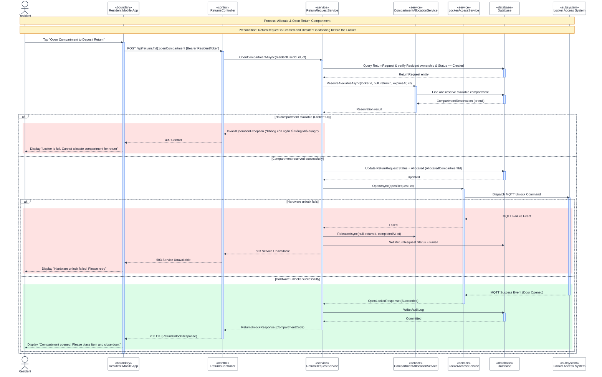

# 3.9.3 Allocate & Open Return Compartment Sequence Diagram

```mermaid
%%{init: {
  "theme": "base",
  "themeVariables": {
    "actorBkg": "#FFFFFF",
    "actorBorder": "#334155",
    "actorTextColor": "#0F172A",
    "actorLineColor": "#94A3B8",
    "signalColor": "#334155",
    "signalTextColor": "#0F172A",
    "activationBkgColor": "#DBEAFE",
    "activationBorderColor": "#2563EB",
    "noteBkgColor": "#FEF3C7",
    "noteBorderColor": "#D97706",
    "noteTextColor": "#111827"
  }
}}%%

sequenceDiagram

actor RES as Resident
participant APP as «boundary»<br/>Resident Mobile App
participant CTRL as «control»<br/>ReturnsController
participant SVC as «service»<br/>ReturnRequestService
participant ALLOC as «service»<br/>CompartmentAllocationService
participant ACCESS as «service»<br/>LockerAccessService
participant DB as «database»<br/>Database
participant LOCKER as «subsystem»<br/>Locker Access System

Note over RES,LOCKER: Process: Allocate & Open Return Compartment
Note over RES,LOCKER: Precondition: ReturnRequest is Created and Resident is standing before the Locker

RES->>APP: Tap "Open Compartment to Deposit Return"
activate APP

APP->>CTRL: POST /api/returns/{id}:openCompartment [Bearer ResidentToken]
activate CTRL

CTRL->>SVC: OpenCompartmentAsync(residentUserId, id, ct)
activate SVC

SVC->>DB: Query ReturnRequest & verify Resident ownership & Status == Created
activate DB
DB-->>SVC: ReturnRequest entity
deactivate DB

SVC->>ALLOC: ReserveAvailableAsync(lockerId, null, returnId, expiresAt, ct)
activate ALLOC
ALLOC->>DB: Find and reserve available compartment
activate DB
DB-->>ALLOC: CompartmentReservation (or null)
deactivate DB
ALLOC-->>SVC: Reservation result
deactivate ALLOC

alt No compartment available (Locker full)
  rect rgb(254,226,226)
    SVC-->>CTRL: InvalidOperationException ("Không còn ngăn tủ trống khả dụng.")
    CTRL-->>APP: 409 Conflict
    APP-->>RES: Display "Locker is full. Cannot allocate compartment for return"
  end
else Compartment reserved successfully
  SVC->>DB: Update ReturnRequest Status = Allocated (AllocatedCompartmentId)
  activate DB
  DB-->>SVC: Updated
  deactivate DB

  SVC->>ACCESS: OpenAsync(openRequest, ct)
  activate ACCESS
  ACCESS->>LOCKER: Dispatch MQTT Unlock Command
  activate LOCKER

  alt Hardware unlock fails
    rect rgb(254,226,226)
      LOCKER-->>ACCESS: MQTT Failure Event
      ACCESS-->>SVC: Failed
      SVC->>ALLOC: ReleaseAsync(null, returnId, completedAt, ct)
      SVC->>DB: Set ReturnRequest Status = Failed
      SVC-->>CTRL: 503 Service Unavailable
      CTRL-->>APP: 503 Service Unavailable
      APP-->>RES: Display "Hardware unlock failed. Please retry"
    end
  else Hardware unlocks successfully
    rect rgb(220,252,231)
      LOCKER-->>ACCESS: MQTT Success Event (Door Opened)
      deactivate LOCKER
      ACCESS-->>SVC: OpenLockerResponse (Succeeded)
      deactivate ACCESS

      SVC->>DB: Write AuditLog
      activate DB
      DB-->>SVC: Committed
      deactivate DB

      SVC-->>CTRL: ReturnUnlockResponse (CompartmentCode)
      deactivate SVC
      CTRL-->>APP: 200 OK (ReturnUnlockResponse)
      deactivate CTRL
      APP-->>RES: Display "Compartment opened. Please place item and close door."
    end
  end
end

deactivate APP
```
