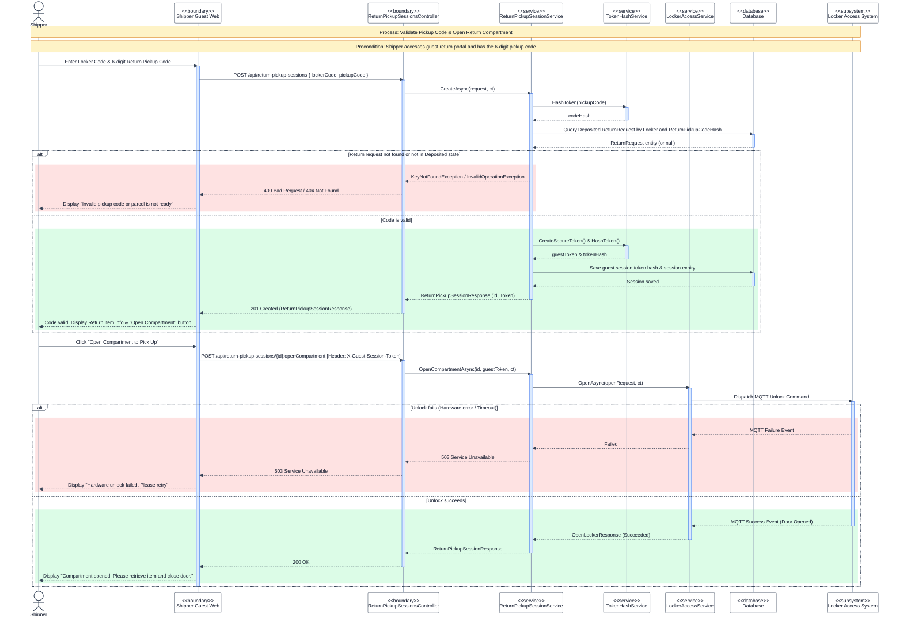

# 3.9.5 Validate Pickup Code & Open Return Compartment Sequence Diagram

```mermaid
%%{init: {
  "theme": "base",
  "themeVariables": {
    "actorBkg": "#FFFFFF",
    "actorBorder": "#334155",
    "actorTextColor": "#0F172A",
    "actorLineColor": "#94A3B8",
    "signalColor": "#334155",
    "signalTextColor": "#0F172A",
    "activationBkgColor": "#DBEAFE",
    "activationBorderColor": "#2563EB",
    "noteBkgColor": "#FEF3C7",
    "noteBorderColor": "#D97706",
    "noteTextColor": "#111827"
  }
}}%%

sequenceDiagram

actor SH as Shipper
participant WEB as <<boundary>><br/>Shipper Guest Web
participant CTRL as <<boundary>><br/>ReturnPickupSessionsController
participant SVC as <<service>><br/>ReturnPickupSessionService
participant TOKEN as <<service>><br/>TokenHashService
participant ACCESS as <<service>><br/>LockerAccessService
participant DB as <<database>><br/>Database
participant LOCKER as <<subsystem>><br/>Locker Access System

Note over SH,LOCKER: Process: Validate Pickup Code & Open Return Compartment
Note over SH,LOCKER: Precondition: Shipper accesses guest return portal and has the 6-digit pickup code

SH->>WEB: Enter Locker Code & 6-digit Return Pickup Code
activate WEB

WEB->>CTRL: POST /api/return-pickup-sessions { lockerCode, pickupCode }
activate CTRL

CTRL->>SVC: CreateAsync(request, ct)
activate SVC

SVC->>TOKEN: HashToken(pickupCode)
activate TOKEN
TOKEN-->>SVC: codeHash
deactivate TOKEN

SVC->>DB: Query Deposited ReturnRequest by Locker and ReturnPickupCodeHash
activate DB
DB-->>SVC: ReturnRequest entity (or null)
deactivate DB

alt Return request not found or not in Deposited state
  rect rgb(254,226,226)
    SVC-->>CTRL: KeyNotFoundException / InvalidOperationException
    CTRL-->>WEB: 400 Bad Request / 404 Not Found
    WEB-->>SH: Display "Invalid pickup code or parcel is not ready"
  end
else Code is valid
  rect rgb(220,252,231)
    SVC->>TOKEN: CreateSecureToken() & HashToken()
    activate TOKEN
    TOKEN-->>SVC: guestToken & tokenHash
    deactivate TOKEN

    SVC->>DB: Save guest session token hash & session expiry
    activate DB
    DB-->>SVC: Session saved
    deactivate DB

    SVC-->>CTRL: ReturnPickupSessionResponse (Id, Token)
    deactivate SVC
    CTRL-->>WEB: 201 Created (ReturnPickupSessionResponse)
    deactivate CTRL
    WEB-->>SH: Code valid! Display Return Item info & "Open Compartment" button
  end
end

SH->>WEB: Click "Open Compartment to Pick Up"
WEB->>CTRL: POST /api/return-pickup-sessions/{id}:openCompartment [Header: X-Guest-Session-Token]
activate CTRL

CTRL->>SVC: OpenCompartmentAsync(id, guestToken, ct)
activate SVC

SVC->>ACCESS: OpenAsync(openRequest, ct)
activate ACCESS
ACCESS->>LOCKER: Dispatch MQTT Unlock Command
activate LOCKER

alt Unlock fails (Hardware error / Timeout)
  rect rgb(254,226,226)
    LOCKER-->>ACCESS: MQTT Failure Event
    ACCESS-->>SVC: Failed
    SVC-->>CTRL: 503 Service Unavailable
    CTRL-->>WEB: 503 Service Unavailable
    WEB-->>SH: Display "Hardware unlock failed. Please retry"
  end
else Unlock succeeds
  rect rgb(220,252,231)
    LOCKER-->>ACCESS: MQTT Success Event (Door Opened)
    deactivate LOCKER
    ACCESS-->>SVC: OpenLockerResponse (Succeeded)
    deactivate ACCESS
    SVC-->>CTRL: ReturnPickupSessionResponse
    deactivate SVC
    CTRL-->>WEB: 200 OK
    deactivate CTRL
    WEB-->>SH: Display "Compartment opened. Please retrieve item and close door."
  end
end

deactivate WEB
```
