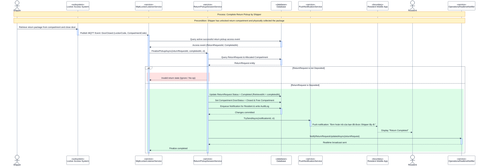

# 3.9.6 Complete Return Pickup Sequence Diagram

```mermaid
%%{init: {
  "theme": "base",
  "themeVariables": {
    "actorBkg": "#FFFFFF",
    "actorBorder": "#334155",
    "actorTextColor": "#0F172A",
    "actorLineColor": "#94A3B8",
    "signalColor": "#334155",
    "signalTextColor": "#0F172A",
    "activationBkgColor": "#DBEAFE",
    "activationBorderColor": "#2563EB",
    "noteBkgColor": "#FEF3C7",
    "noteBorderColor": "#D97706",
    "noteTextColor": "#111827"
  }
}}%%

sequenceDiagram

actor SH as Shipper
participant LOCKER as «subsystem»<br/>Locker Access System
participant LISTENER as «service»<br/>MqttLockerListenerService
participant SVC as «service»<br/>ReturnPickupSessionService
participant DB as «database»<br/>Database
participant PUSH as «service»<br/>PushNotificationService
participant APP as «boundary»<br/>Resident Mobile App
actor RES as Resident
participant HUB as «service»<br/>OperationsRealtimeNotifier

Note over SH,HUB: Process: Complete Return Pickup by Shipper
Note over SH,HUB: Precondition: Shipper has unlocked return compartment and physically collected the package

SH->>LOCKER: Retrieve return package from compartment and close door
activate LOCKER

LOCKER-->>LISTENER: Publish MQTT Event: DoorClosed (LockerCode, CompartmentCode)
deactivate LOCKER
activate LISTENER

LISTENER->>DB: Query active successful return pickup access event
activate DB
DB-->>LISTENER: Access event (ReturnRequestId, CompletedAt)
deactivate DB

LISTENER->>SVC: FinalizePickupAsync(returnRequestId, completedAt, ct)
activate SVC

SVC->>DB: Query ReturnRequest & Allocated Compartment
activate DB
DB-->>SVC: ReturnRequest entity
deactivate DB

alt ReturnRequest is not Deposited
  rect rgb(254,226,226)
    SVC-->>LISTENER: Invalid return state (Ignore / No-op)
  end
else ReturnRequest is Deposited
  rect rgb(220,252,231)
    SVC->>DB: Update ReturnRequest Status = Completed (RetrievedAt = completedAt)
    SVC->>DB: Set Compartment DoorStatus = Closed & Free Compartment
    SVC->>DB: Enqueue Notification for Resident & write AuditLog
    activate DB
    DB-->>SVC: Changes committed
    deactivate DB

    SVC->>PUSH: TrySendAsync(notificationId, ct)
    activate PUSH
    PUSH-->>APP: Push notification: "Đơn hoàn trả của bạn đã được Shipper lấy đi."
    deactivate PUSH
    APP-->>RES: Display "Return Completed"

    SVC->>HUB: NotifyReturnRequestUpdatedAsync(returnRequest)
    activate HUB
    HUB-->>SVC: Realtime broadcast sent
    deactivate HUB

    SVC-->>LISTENER: Finalize completed
  end
end

deactivate SVC
deactivate LISTENER
```
