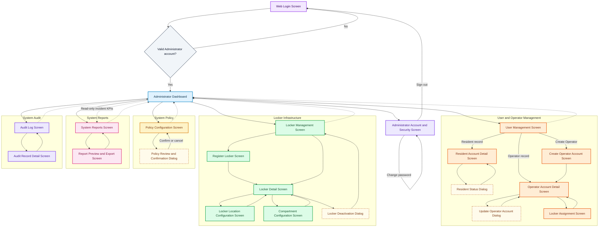

# Administrator Web Application Screen Flow

```mermaid
flowchart TD
    classDef auth fill:#F3E8FF,stroke:#9333EA,stroke-width:2px,color:#3B0764
    classDef dash fill:#E0F2FE,stroke:#0284C7,stroke-width:2px,color:#082F49
    classDef user fill:#FFEDD5,stroke:#EA580C,stroke-width:2px,color:#7C2D12
    classDef locker fill:#DCFCE7,stroke:#16A34A,stroke-width:2px,color:#14532D
    classDef policy fill:#FEF3C7,stroke:#D97706,stroke-width:2px,color:#78350F
    classDef report fill:#FCE7F3,stroke:#DB2777,stroke-width:2px,color:#831843
    classDef audit fill:#EDE9FE,stroke:#7C3AED,stroke-width:2px,color:#4C1D95
    classDef modal fill:#FFFBEB,stroke:#B45309,stroke-width:1.5px,stroke-dasharray:4 4,color:#78350F
    classDef condition fill:#F1F5F9,stroke:#475569,stroke-width:2px,color:#0F172A

    Login["Web Login Screen"]:::auth
    ValidAdmin{"Valid Administrator account?"}:::condition
    Dashboard["Administrator Dashboard"]:::dash

    subgraph USERS["User and Operator Management"]
        UserManagement["User Management Screen"]:::user
        ResidentDetail["Resident Account Detail Screen"]:::user
        ResidentStatus["Resident Status Dialog"]:::modal
        OperatorDetail["Operator Account Detail Screen"]:::user
        CreateOperator["Create Operator Account Screen"]:::user
        UpdateOperator["Update Operator Account Dialog"]:::modal
        LockerAssignment["Locker Assignment Screen"]:::user
    end

    subgraph LOCKERS["Locker Infrastructure"]
        LockerManagement["Locker Management Screen"]:::locker
        RegisterLocker["Register Locker Screen"]:::locker
        LockerDetail["Locker Detail Screen"]:::locker
        LocationConfig["Locker Location Configuration Screen"]:::locker
        CompartmentConfig["Compartment Configuration Screen"]:::locker
        LockerDeactivate["Locker Deactivation Dialog"]:::modal
    end

    subgraph POLICY["System Policy"]
        PolicyConfig["Policy Configuration Screen"]:::policy
        PolicyReview["Policy Review and Confirmation Dialog"]:::modal
    end

    subgraph REPORTS["System Reports"]
        Reports["System Reports Screen"]:::report
        ReportPreview["Report Preview and Export Screen"]:::report
    end

    subgraph AUDIT["System Audit"]
        AuditLog["Audit Log Screen"]:::audit
        AuditDetail["Audit Record Detail Screen"]:::audit
    end

    Account["Administrator Account and Security Screen"]:::audit

    Login --> ValidAdmin
    ValidAdmin -->|No| Login
    ValidAdmin -->|Yes| Dashboard

    Dashboard --> UserManagement
    UserManagement -->|Resident record| ResidentDetail
    ResidentDetail --> ResidentStatus
    ResidentStatus --> ResidentDetail
    UserManagement -->|Operator record| OperatorDetail
    UserManagement -->|Create Operator| CreateOperator
    CreateOperator --> OperatorDetail
    OperatorDetail --> UpdateOperator
    OperatorDetail --> LockerAssignment
    UpdateOperator --> OperatorDetail
    LockerAssignment --> OperatorDetail

    Dashboard --> LockerManagement
    LockerManagement --> RegisterLocker
    RegisterLocker --> LockerDetail
    LockerManagement --> LockerDetail
    LockerDetail --> LocationConfig
    LockerDetail --> CompartmentConfig
    LockerDetail --> LockerDeactivate
    LocationConfig --> LockerDetail
    CompartmentConfig --> LockerDetail
    LockerDeactivate --> LockerManagement

    Dashboard --> PolicyConfig
    PolicyConfig --> PolicyReview
    PolicyReview -->|Confirm or cancel| PolicyConfig

    Dashboard --> Reports
    Reports --> ReportPreview
    ReportPreview --> Reports

    Dashboard --> AuditLog
    AuditLog --> AuditDetail
    AuditDetail --> AuditLog

    Dashboard --> Account
    Account -->|Change password| Account
    Account -->|Sign out| Login

    UserManagement -.-> Dashboard
    LockerManagement -.-> Dashboard
    PolicyConfig -.-> Dashboard
    Reports -.-> Dashboard
    AuditLog -.-> Dashboard

    Dashboard -.->|Read-only incident KPIs| Reports
```
