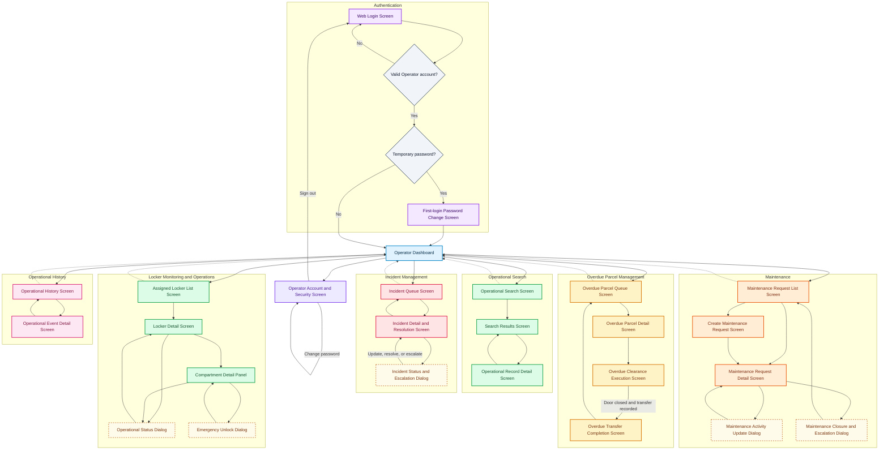

# Locker Operator Web Application Screen Flow

```mermaid
flowchart TD
    classDef auth fill:#F3E8FF,stroke:#9333EA,stroke-width:2px,color:#3B0764
    classDef dash fill:#E0F2FE,stroke:#0284C7,stroke-width:2px,color:#082F49
    classDef locker fill:#DCFCE7,stroke:#16A34A,stroke-width:2px,color:#14532D
    classDef incident fill:#FFE4E6,stroke:#E11D48,stroke-width:2px,color:#881337
    classDef overdue fill:#FEF3C7,stroke:#D97706,stroke-width:2px,color:#78350F
    classDef maintenance fill:#FFEDD5,stroke:#EA580C,stroke-width:2px,color:#7C2D12
    classDef history fill:#FCE7F3,stroke:#DB2777,stroke-width:2px,color:#831843
    classDef account fill:#EDE9FE,stroke:#7C3AED,stroke-width:2px,color:#4C1D95
    classDef modal fill:#FFFBEB,stroke:#B45309,stroke-width:1.5px,stroke-dasharray:4 4,color:#78350F
    classDef condition fill:#F1F5F9,stroke:#475569,stroke-width:2px,color:#0F172A

    subgraph AUTH["Authentication"]
        Login["Web Login Screen"]:::auth
        ValidOperator{"Valid Operator account?"}:::condition
        FirstLogin{"Temporary password?"}:::condition
        ChangePassword["First-login Password Change Screen"]:::auth
    end

    Dashboard["Operator Dashboard"]:::dash

    subgraph LOCKERS["Locker Monitoring and Operations"]
        LockerList["Assigned Locker List Screen"]:::locker
        LockerDetail["Locker Detail Screen"]:::locker
        Compartment["Compartment Detail Panel"]:::locker
        OperationalStatus["Operational Status Dialog"]:::modal
        EmergencyUnlock["Emergency Unlock Dialog"]:::modal
    end

    subgraph SEARCH["Operational Search"]
        SearchScreen["Operational Search Screen"]:::locker
        SearchResults["Search Results Screen"]:::locker
        RecordDetail["Operational Record Detail Screen"]:::locker
    end

    subgraph INCIDENTS["Incident Management"]
        IncidentQueue["Incident Queue Screen"]:::incident
        IncidentDetail["Incident Detail and Resolution Screen"]:::incident
        IncidentAction["Incident Status and Escalation Dialog"]:::modal
    end

    subgraph OVERDUE["Overdue Parcel Management"]
        OverdueQueue["Overdue Parcel Queue Screen"]:::overdue
        OverdueDetail["Overdue Parcel Detail Screen"]:::overdue
        Clearance["Overdue Clearance Execution Screen"]:::overdue
        TransferComplete["Overdue Transfer Completion Screen"]:::overdue
    end

    subgraph MAINTENANCE["Maintenance"]
        MaintenanceList["Maintenance Request List Screen"]:::maintenance
        MaintenanceDetail["Maintenance Request Detail Screen"]:::maintenance
        CreateMaintenance["Create Maintenance Request Screen"]:::maintenance
        UpdateMaintenance["Maintenance Activity Update Dialog"]:::modal
        CloseMaintenance["Maintenance Closure and Escalation Dialog"]:::modal
    end

    subgraph HISTORY["Operational History"]
        OperationalHistory["Operational History Screen"]:::history
        EventDetail["Operational Event Detail Screen"]:::history
    end

    Account["Operator Account and Security Screen"]:::account

    Login --> ValidOperator
    ValidOperator -->|No| Login
    ValidOperator -->|Yes| FirstLogin
    FirstLogin -->|Yes| ChangePassword
    ChangePassword --> Dashboard
    FirstLogin -->|No| Dashboard

    Dashboard --> LockerList
    LockerList --> LockerDetail
    LockerDetail --> Compartment
    LockerDetail --> OperationalStatus
    Compartment --> OperationalStatus
    Compartment --> EmergencyUnlock
    OperationalStatus --> LockerDetail
    EmergencyUnlock --> Compartment

    Dashboard --> SearchScreen
    SearchScreen --> SearchResults
    SearchResults --> RecordDetail
    RecordDetail --> SearchResults

    Dashboard --> IncidentQueue
    IncidentQueue --> IncidentDetail
    IncidentDetail --> IncidentAction
    IncidentAction -->|Update, resolve, or escalate| IncidentDetail
    IncidentDetail --> IncidentQueue

    Dashboard --> OverdueQueue
    OverdueQueue --> OverdueDetail
    OverdueDetail --> Clearance
    Clearance -->|Door closed and transfer recorded| TransferComplete
    TransferComplete --> OverdueQueue

    Dashboard --> MaintenanceList
    MaintenanceList --> MaintenanceDetail
    MaintenanceList --> CreateMaintenance
    CreateMaintenance --> MaintenanceDetail
    MaintenanceDetail --> UpdateMaintenance
    MaintenanceDetail --> CloseMaintenance
    UpdateMaintenance --> MaintenanceDetail
    CloseMaintenance --> MaintenanceList

    Dashboard --> OperationalHistory
    OperationalHistory --> EventDetail
    EventDetail --> OperationalHistory

    Dashboard --> Account
    Account -->|Change password| Account
    Account -->|Sign out| Login

    LockerList -.-> Dashboard
    SearchScreen -.-> Dashboard
    IncidentQueue -.-> Dashboard
    OverdueQueue -.-> Dashboard
    MaintenanceList -.-> Dashboard
    OperationalHistory -.-> Dashboard
```

