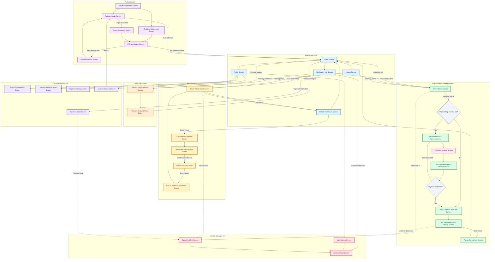

# Resident Mobile Application Screen Flow

```mermaid
flowchart TD
    classDef auth fill:#F3E8FF,stroke:#9333EA,stroke-width:2px,color:#3B0764
    classDef main fill:#E0F2FE,stroke:#0284C7,stroke-width:2px,color:#082F49
    classDef delivery fill:#FFEDD5,stroke:#EA580C,stroke-width:2px,color:#7C2D12
    classDef retrieval fill:#DCFCE7,stroke:#16A34A,stroke-width:2px,color:#14532D
    classDef returns fill:#FEF3C7,stroke:#D97706,stroke-width:2px,color:#78350F
    classDef support fill:#FFE4E6,stroke:#E11D48,stroke-width:2px,color:#881337
    classDef profile fill:#EDE9FE,stroke:#7C3AED,stroke-width:2px,color:#4C1D95
    classDef external fill:#FCE7F3,stroke:#DB2777,stroke-width:2px,color:#831843
    classDef condition fill:#F1F5F9,stroke:#475569,stroke-width:2px,color:#0F172A

    subgraph AUTH["Authentication"]
        Welcome["Resident Welcome Screen"]:::auth
        Login["Resident Login Screen"]:::auth
        Register["Resident Registration Screen"]:::auth
        OTP["OTP Verification Screen"]:::auth
        Forgot["Forgot Password Screen"]:::auth
        Reset["Reset Password Screen"]:::auth
    end

    subgraph MAIN["Main Navigation"]
        Home["Home Screen"]:::main
        Notifications["Notification List Screen"]:::main
        History["History Screen"]:::main
        ReturnList["Return Parcel List Screen"]:::main
        Profile["Profile Screen"]:::main
    end

    subgraph DELIVERY["Delivery Approval"]
        DeliveryDetail["Delivery Request Detail Screen"]:::delivery
        DeliveryAction["Delivery Request Action Dialog"]:::delivery
    end

    subgraph RETRIEVAL["Parcel Retrieval and Payment"]
        ParcelDetail["Parcel Detail Screen"]:::retrieval
        FeeRequired{"Outstanding overdue fee?"}:::condition
        FeeSummary["Fee Summary and Payment Screen"]:::retrieval
        PayOS["PayOS Checkout Screen"]:::external
        PaymentResult["Payment Result and Receipt Screen"]:::retrieval
        Paid{"Payment confirmed?"}:::condition
        UnlockMethod["Unlock Method Selection Screen"]:::retrieval
        Opening["Locker Opening and Pickup Screen"]:::retrieval
        PickupComplete["Pickup Completion Screen"]:::retrieval
    end

    subgraph RETURN_FLOW["Return Parcel"]
        CreateReturn["Create Return Request Screen"]:::returns
        ReviewReturn["Return Request Review Screen"]:::returns
        ReturnDeposit["Return Deposit Screen"]:::returns
        ReturnComplete["Return Deposit Completion Screen"]:::returns
        ReturnDetail["Return Parcel Detail Screen"]:::returns
    end

    subgraph ACCOUNT["Profile and Account"]
        PersonalInfo["Personal Information Screen"]:::profile
        ApprovalMode["Delivery Approval Mode Screen"]:::profile
        PaymentHistory["Payment History Screen"]:::profile
        PaymentDetail["Payment Detail Screen"]:::profile
        AccountSecurity["Account Security Screen"]:::profile
    end

    subgraph INCIDENTS["Incident Management"]
        MyIncidents["My Incidents Screen"]:::support
        IncidentDetail["Incident Detail Screen"]:::support
        SubmitIncident["Submit Incident Screen"]:::support
    end

    Welcome --> Login
    Welcome --> Register
    Register --> OTP
    OTP -->|Registration verified| Home
    Login -->|Forgot password| Forgot
    Forgot --> OTP
    OTP -->|Recovery verified| Reset
    Reset --> Login
    Login -->|Authenticated| Home

    Home <--> History
    Home <--> ReturnList
    Home <--> Profile
    Home --> Notifications
    Notifications -->|Delivery notification| DeliveryDetail
    Notifications -->|Parcel notification| ParcelDetail
    Notifications -->|Payment notification| PaymentDetail
    Notifications -->|Incident notification| IncidentDetail
    Notifications -->|Return notification| ReturnDetail

    Home -->|Pending request| DeliveryDetail
    DeliveryDetail --> DeliveryAction
    DeliveryAction -->|Approve or reject| Home

    Home -->|Active parcel| ParcelDetail
    History -->|Incoming parcel| ParcelDetail
    ParcelDetail -->|Retrieve parcel| FeeRequired
    FeeRequired -->|Yes| FeeSummary
    FeeRequired -->|No| UnlockMethod
    FeeSummary --> PayOS
    PayOS --> PaymentResult
    PaymentResult --> Paid
    Paid -->|Yes| UnlockMethod
    Paid -->|No or cancelled| FeeSummary
    UnlockMethod --> Opening
    Opening -->|Door closed| PickupComplete
    PickupComplete --> Home

    ReturnList -->|Create return| CreateReturn
    ReturnList -->|Open return| ReturnDetail
    History -->|Return parcel| ReturnDetail
    CreateReturn --> ReviewReturn
    ReviewReturn -->|Confirm and allocate| ReturnDeposit
    ReturnDeposit -->|Door closed| ReturnComplete
    ReturnComplete --> ReturnDetail
    ReturnDetail --> ReturnList

    Profile --> PersonalInfo
    Profile --> ApprovalMode
    Profile --> PaymentHistory
    PaymentHistory --> PaymentDetail
    Profile --> MyIncidents
    MyIncidents --> IncidentDetail
    Profile --> AccountSecurity
    AccountSecurity -->|Sign out| Login

    ParcelDetail -.->|Report issue| SubmitIncident
    Opening -.->|Locker or door issue| SubmitIncident
    ReturnDetail -.->|Return issue| SubmitIncident
    PaymentDetail -.->|Payment issue| SubmitIncident
    SubmitIncident --> IncidentDetail
```

