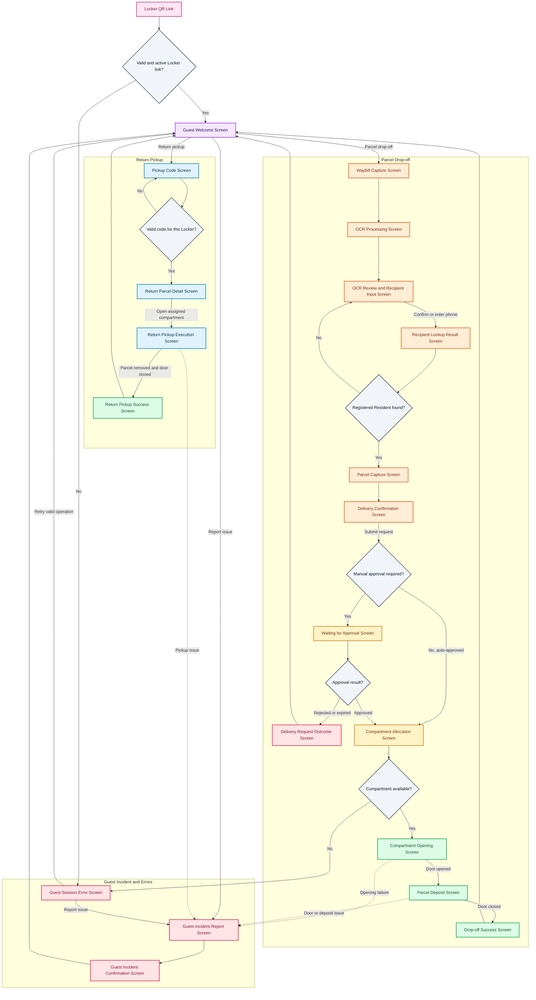

# Shipper Guest Web Screen Flow

```mermaid
flowchart TD
    classDef guest fill:#F3E8FF,stroke:#9333EA,stroke-width:2px,color:#3B0764
    classDef dropoff fill:#FFEDD5,stroke:#EA580C,stroke-width:2px,color:#7C2D12
    classDef approval fill:#FEF3C7,stroke:#D97706,stroke-width:2px,color:#78350F
    classDef success fill:#DCFCE7,stroke:#16A34A,stroke-width:2px,color:#14532D
    classDef pickup fill:#E0F2FE,stroke:#0284C7,stroke-width:2px,color:#082F49
    classDef incident fill:#FFE4E6,stroke:#E11D48,stroke-width:2px,color:#881337
    classDef external fill:#FCE7F3,stroke:#DB2777,stroke-width:2px,color:#831843
    classDef condition fill:#F1F5F9,stroke:#475569,stroke-width:2px,color:#0F172A

    QR["Locker QR Link"]:::external
    ValidLink{"Valid and active Locker link?"}:::condition
    Welcome["Guest Welcome Screen"]:::guest

    subgraph DROPOFF["Parcel Drop-off"]
        Waybill["Waybill Capture Screen"]:::dropoff
        OCR["OCR Processing Screen"]:::dropoff
        RecipientInput["OCR Review and Recipient Input Screen"]:::dropoff
        Lookup["Recipient Lookup Result Screen"]:::dropoff
        Found{"Registered Resident found?"}:::condition
        ParcelCapture["Parcel Capture Screen"]:::dropoff
        DeliveryConfirm["Delivery Confirmation Screen"]:::dropoff
        ApprovalMode{"Manual approval required?"}:::condition
        Waiting["Waiting for Approval Screen"]:::approval
        ApprovalResult{"Approval result?"}:::condition
        Outcome["Delivery Request Outcome Screen"]:::incident
        Allocation["Compartment Allocation Screen"]:::approval
        Allocated{"Compartment available?"}:::condition
        Opening["Compartment Opening Screen"]:::success
        Deposit["Parcel Deposit Screen"]:::success
        DropoffSuccess["Drop-off Success Screen"]:::success
    end

    subgraph PICKUP["Return Pickup"]
        PickupCode["Pickup Code Screen"]:::pickup
        ValidCode{"Valid code for this Locker?"}:::condition
        ReturnDetail["Return Parcel Detail Screen"]:::pickup
        PickupExecution["Return Pickup Execution Screen"]:::pickup
        PickupSuccess["Return Pickup Success Screen"]:::success
    end

    subgraph SUPPORT["Guest Incident and Errors"]
        IncidentReport["Guest Incident Report Screen"]:::incident
        IncidentConfirm["Guest Incident Confirmation Screen"]:::incident
        SessionError["Guest Session Error Screen"]:::incident
    end

    QR --> ValidLink
    ValidLink -->|Yes| Welcome
    ValidLink -->|No| SessionError

    Welcome -->|Parcel drop-off| Waybill
    Waybill --> OCR
    OCR --> RecipientInput
    RecipientInput -->|Confirm or enter phone| Lookup
    Lookup --> Found
    Found -->|No| RecipientInput
    Found -->|Yes| ParcelCapture
    ParcelCapture --> DeliveryConfirm
    DeliveryConfirm -->|Submit request| ApprovalMode
    ApprovalMode -->|Yes| Waiting
    ApprovalMode -->|No, auto-approved| Allocation
    Waiting --> ApprovalResult
    ApprovalResult -->|Approved| Allocation
    ApprovalResult -->|Rejected or expired| Outcome
    Outcome --> Welcome
    Allocation --> Allocated
    Allocated -->|No| SessionError
    Allocated -->|Yes| Opening
    Opening -->|Door opened| Deposit
    Deposit -->|Door closed| DropoffSuccess
    DropoffSuccess --> Welcome

    Welcome -->|Return pickup| PickupCode
    PickupCode --> ValidCode
    ValidCode -->|No| PickupCode
    ValidCode -->|Yes| ReturnDetail
    ReturnDetail -->|Open assigned compartment| PickupExecution
    PickupExecution -->|Parcel removed and door closed| PickupSuccess
    PickupSuccess --> Welcome

    Welcome -->|Report issue| IncidentReport
    Opening -.->|Opening failure| IncidentReport
    Deposit -.->|Door or deposit issue| IncidentReport
    PickupExecution -.->|Pickup issue| IncidentReport
    IncidentReport --> IncidentConfirm
    IncidentConfirm --> Welcome

    SessionError -->|Retry valid operation| Welcome
    SessionError -->|Report issue| IncidentReport
```

